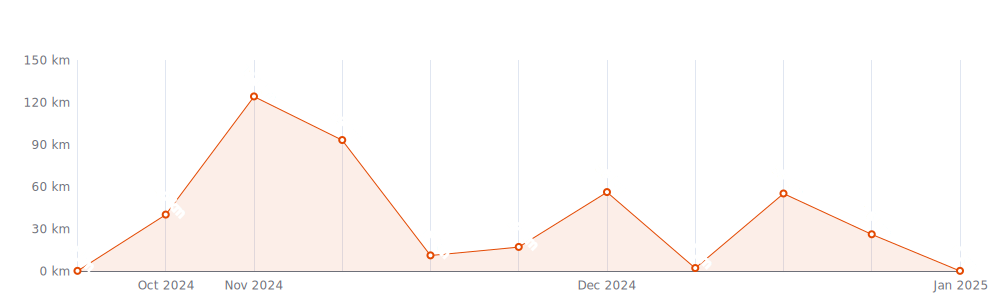
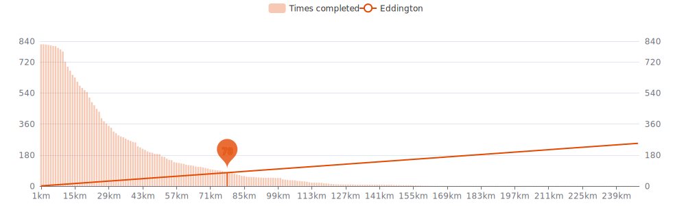
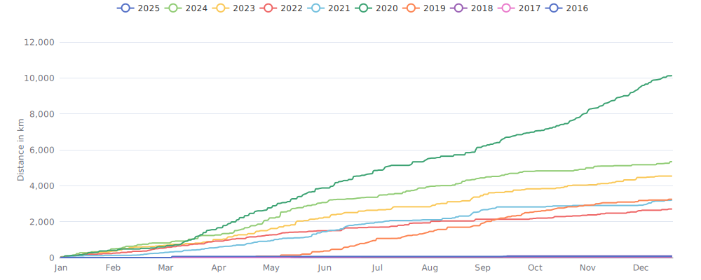

    

Since I began cycling `9 years and 5 months` ago on `07-03-2016`,
I had `811 cycling days`. 
I recorded a total distance of `28 755 km`
(`0.72` trips around the world 🌍 and
`0.075` trips to the moon 🌕),
an elevation of `81 566 m`
(`9.2` times Mount Everest 🏔)
and a total time of `1mo 3w 2d 10h 36m` 🎉

That's a daily average of `9 km`,
a weekly average of `63 km` and a
monthly average of `274 km` 🐣

I burned `650031 calories` doing so, that's about `2 408` pizza slices 🍕

---

<kbd><a href="#weekly-distances">Weekly distances</a></kbd> |
<kbd><a href="#activities">Activities</a></kbd> |
<kbd><a href="#monthly-stats">Monthly stats</a></kbd> |
<kbd><a href="#activity-intensity">Activity intensity</a></kbd> |
<kbd><a href="#stats-per-weekday">Stats per weekday</a></kbd> |
<kbd><a href="#daytime-stats">Daytime stats</a></kbd> |
<kbd><a href="#stats-per-bike">Stats per bike</a></kbd> |
<kbd><a href="#best-power-outputs-over-time">Power outputs</a></kbd> |
<kbd><a href="#eddington-chart">Eddington</a></kbd> |
<kbd><a href="#yearly-distances">Yearly distances</a></kbd> |
<kbd><a href="#distance-breakdown">Distance breakdown</a></kbd> |
<kbd><a href="#challenge-consistency">Challenge consistency</a></kbd> |
<kbd><a href="#completed-challenges">Completed challenges</a></kbd>

## Weekly distances

## Activities

<table>
    <tr>
        <th></th>
        <th></th>
        <th align="center"></th>
        <th align="center"></th>
        <th align="center"></th>
        <th align="center"></th>
        <th align="center"></th>
        <th align="center"></th>
    </tr>
            <tr>
            <td>19-11-24</td>
            <td>
                
<a href="https://www.strava.com/activities/12938812226" title="Kcal: 727 | Gear: Ridley Fenix ">Pistefietsen met Iljo</a>
            </td>
            <td align="center">11 km</td>
            <td align="center">36 m</td>
            <td align="center">1:03:31</td>
            <td align="center">85 w</td>
            <td align="center">10.8 km/h</td>
            <td align="center">144</td>
        </tr>
            <tr>
            <td>17-11-24</td>
            <td>
                
<a href="https://www.strava.com/activities/12918918972" title="Kcal: 242 | Gear: State Bicycle Rutherford 3.0 ">Minstens 10 zei meester Pi...</a>
            </td>
            <td align="center">10 km</td>
            <td align="center">24 m</td>
            <td align="center">26:27</td>
            <td align="center">88 w</td>
            <td align="center">21.6 km/h</td>
            <td align="center">125</td>
        </tr>
            <tr>
            <td>15-11-24</td>
            <td>
                
<a href="https://www.strava.com/activities/12907591861" title="Kcal: 2051 | Gear: Ridley Fenix ">👷</a>
            </td>
            <td align="center">84 km</td>
            <td align="center">141 m</td>
            <td align="center">3:02:27</td>
            <td align="center">118 w</td>
            <td align="center">27.5 km/h</td>
            <td align="center">147</td>
        </tr>
            <tr>
            <td>10-11-24</td>
            <td>
                
<a href="https://www.strava.com/activities/12867818504" title="Kcal: 1550 | Gear: Ridley Fenix ">28k✅ 🍂🍁</a>
            </td>
            <td align="center">82 km</td>
            <td align="center">127 m</td>
            <td align="center">3:05:23</td>
            <td align="center">112 w</td>
            <td align="center">26.5 km/h</td>
            <td align="center">135</td>
        </tr>
            <tr>
            <td>06-11-24</td>
            <td>
                
<a href="https://www.strava.com/activities/12838589077" title="Kcal: 974 | Gear: Kona Honzo MTB ">In den donker met wiki 🔦</a>
            </td>
            <td align="center">32 km</td>
            <td align="center">85 m</td>
            <td align="center">1:38:55</td>
            <td align="center">70 w</td>
            <td align="center">19.5 km/h</td>
            <td align="center">140</td>
        </tr>
        </table>

    
Older activities

    <table>
        <tr>
            <th></th>
            <th></th>
            <th align="center"></th>
            <th align="center"></th>
            <th align="center"></th>
            <th align="center"></th>
            <th align="center"></th>
            <th align="center"></th>
        </tr>
                    <tr>
                <td>05-11-24</td>
                <td>
                    
<a href="https://www.strava.com/activities/12832211122" title="Kcal: 258 | Gear: State Bicycle Rutherford 3.0 ">Minstens 10 zei meester Pi...</a>
                </td>
                <td align="center">10 km</td>
                <td align="center">46 m</td>
                <td align="center">28:01</td>
                <td align="center">94 w</td>
                <td align="center">22 km/h</td>
                <td align="center">121</td>
            </tr>
                    <tr>
                <td>03-11-24</td>
                <td>
                    
<a href="https://www.strava.com/activities/12816903989" title="Kcal: 521 | Gear: Bianchi/Tacx ">SIMONE 🤸🏻‍♀️🥇</a>
                </td>
                <td align="center">40 km</td>
                <td align="center">0 m</td>
                <td align="center">1:15:27</td>
                <td align="center">n/a</td>
                <td align="center">31.9 km/h</td>
                <td align="center">118</td>
            </tr>
                    <tr>
                <td>11-10-24</td>
                <td>
                    
<a href="https://www.strava.com/activities/12642183211" title="Kcal: 409 | Gear: State Bicycle Rutherford 3.0 ">🎒🏫🕺🏻</a>
                </td>
                <td align="center">15 km</td>
                <td align="center">65 m</td>
                <td align="center">43:57</td>
                <td align="center">80 w</td>
                <td align="center">21 km/h</td>
                <td align="center">123</td>
            </tr>
                    <tr>
                <td>10-10-24</td>
                <td>
                    
<a href="https://www.strava.com/activities/12624653739" title="Kcal: 412 | Gear: State Bicycle Rutherford 3.0 ">🎒🏫🏊🏻‍♀️</a>
                </td>
                <td align="center">13 km</td>
                <td align="center">38 m</td>
                <td align="center">39:24</td>
                <td align="center">77 w</td>
                <td align="center">20.1 km/h</td>
                <td align="center">127</td>
            </tr>
                    <tr>
                <td>03-10-24</td>
                <td>
                    
<a href="https://www.strava.com/activities/12562555026" title="Kcal: 1146 | Gear: Ridley Fenix ">🎒🏫👷‍♂️</a>
                </td>
                <td align="center">46 km</td>
                <td align="center">70 m</td>
                <td align="center">1:51:58</td>
                <td align="center">100 w</td>
                <td align="center">24.5 km/h</td>
                <td align="center">141</td>
            </tr>
                    <tr>
                <td>01-10-24</td>
                <td>
                    
<a href="https://www.strava.com/activities/12551092221" title="Kcal: 411 | Gear: Bianchi/Tacx ">AFTERSHOCK🗻</a>
                </td>
                <td align="center">34 km</td>
                <td align="center">0 m</td>
                <td align="center">1:06:11</td>
                <td align="center">n/a</td>
                <td align="center">30.8 km/h</td>
                <td align="center">113</td>
            </tr>
                    <tr>
                <td>26-09-24</td>
                <td>
                    
<a href="https://www.strava.com/activities/12506724703" title="Kcal: 443 | Gear: State Bicycle Rutherford 3.0 ">🏫🎒💉🆎</a>
                </td>
                <td align="center">15 km</td>
                <td align="center">27 m</td>
                <td align="center">41:16</td>
                <td align="center">79 w</td>
                <td align="center">21.1 km/h</td>
                <td align="center">130</td>
            </tr>
                    <tr>
                <td>25-09-24</td>
                <td>
                    
<a href="https://www.strava.com/activities/12503787722" title="Kcal: 474 | Gear: Bianchi/Tacx ">🧗🏻‍♀️Duell am Abgrund🧗🏻‍♀️...</a>
                </td>
                <td align="center">42 km</td>
                <td align="center">0 m</td>
                <td align="center">1:29:23</td>
                <td align="center">n/a</td>
                <td align="center">28.1 km/h</td>
                <td align="center">108</td>
            </tr>
                    <tr>
                <td>23-09-24</td>
                <td>
                    
<a href="https://www.strava.com/activities/12483559181" title="Kcal: 989 | Gear: State Bicycle Rutherford 3.0 ">Traveling Postman Problem ...</a>
                </td>
                <td align="center">45 km</td>
                <td align="center">125 m</td>
                <td align="center">1:55:24</td>
                <td align="center">101 w</td>
                <td align="center">23.2 km/h</td>
                <td align="center">125</td>
            </tr>
                    <tr>
                <td>21-09-24</td>
                <td>
                    
<a href="https://www.strava.com/activities/12470181937" title="Kcal: 364 | Gear: Bianchi/Tacx ">SIMONE 🤸🏻‍♀️</a>
                </td>
                <td align="center">30 km</td>
                <td align="center">0 m</td>
                <td align="center">55:01</td>
                <td align="center">n/a</td>
                <td align="center">33.1 km/h</td>
                <td align="center">113</td>
            </tr>
                    <tr>
                <td>20-09-24</td>
                <td>
                    
<a href="https://www.strava.com/activities/12460899230" title="Kcal: 436 | Gear: State Bicycle Rutherford 3.0 ">Traveling Postman Problem ...</a>
                </td>
                <td align="center">31 km</td>
                <td align="center">48 m</td>
                <td align="center">1:30:35</td>
                <td align="center">72 w</td>
                <td align="center">20.4 km/h</td>
                <td align="center">120</td>
            </tr>
                    <tr>
                <td>19-09-24</td>
                <td>
                    
<a href="https://www.strava.com/activities/12447888497" title="Kcal: 135 | Gear: State Bicycle Rutherford 3.0 ">Met nr. 1 nr skool</a>
                </td>
                <td align="center">5 km</td>
                <td align="center">9 m</td>
                <td align="center">13:52</td>
                <td align="center">82 w</td>
                <td align="center">20.4 km/h</td>
                <td align="center">120</td>
            </tr>
                    <tr>
                <td>15-09-24</td>
                <td>
                    
<a href="https://www.strava.com/activities/12419458720" title="Kcal: 837 | Gear: Kona Honzo MTB ">The Waiting Game 🌔 &gt; &quot; &#039;k ...</a>
                </td>
                <td align="center">26 km</td>
                <td align="center">92 m</td>
                <td align="center">1:12:40</td>
                <td align="center">195 w</td>
                <td align="center">21.5 km/h</td>
                <td align="center">144</td>
            </tr>
                    <tr>
                <td>12-09-24</td>
                <td>
                    
<a href="https://www.strava.com/activities/12392143489" title="Kcal: 369 | Gear: State Bicycle Rutherford 3.0 ">Ziekenvervoer</a>
                </td>
                <td align="center">15 km</td>
                <td align="center">26 m</td>
                <td align="center">45:08</td>
                <td align="center">78 w</td>
                <td align="center">20.2 km/h</td>
                <td align="center">120</td>
            </tr>
                    <tr>
                <td>11-09-24</td>
                <td>
                    
<a href="https://www.strava.com/activities/12384467796" title="Kcal: 1155 | Gear: Ridley Fenix ">👷‍♂️ met Robinho</a>
                </td>
                <td align="center">41 km</td>
                <td align="center">80 m</td>
                <td align="center">1:35:52</td>
                <td align="center">113 w</td>
                <td align="center">25.4 km/h</td>
                <td align="center">150</td>
            </tr>
                    <tr>
                <td>08-09-24</td>
                <td>
                    
<a href="https://www.strava.com/activities/12360967210" title="Kcal: 574 | Gear: State Bicycle Rutherford 3.0 ">80 jaar bevrijding 🇨🇦🪖🥞2️⃣...</a>
                </td>
                <td align="center">26 km</td>
                <td align="center">71 m</td>
                <td align="center">1:25:18</td>
                <td align="center">64 w</td>
                <td align="center">17.9 km/h</td>
                <td align="center">111</td>
            </tr>
                    <tr>
                <td>07-09-24</td>
                <td>
                    
<a href="https://www.strava.com/activities/12352712731" title="Kcal: 392 | Gear: State Bicycle Rutherford 3.0 ">80 jaar bevrijding 🇨🇦🪖🍦...</a>
                </td>
                <td align="center">12 km</td>
                <td align="center">34 m</td>
                <td align="center">48:13</td>
                <td align="center">42 w</td>
                <td align="center">14.8 km/h</td>
                <td align="center">116</td>
            </tr>
                    <tr>
                <td>06-09-24</td>
                <td>
                    
<a href="https://www.strava.com/activities/12347787020" title="Kcal: 445 | Gear: State Bicycle Rutherford 3.0 ">VBC</a>
                </td>
                <td align="center">17 km</td>
                <td align="center">94 m</td>
                <td align="center">44:56</td>
                <td align="center">80 w</td>
                <td align="center">22.2 km/h</td>
                <td align="center">127</td>
            </tr>
                    <tr>
                <td>05-09-24</td>
                <td>
                    
<a href="https://www.strava.com/activities/12336056013" title="Kcal: 606 | Gear: Bianchi/Tacx ">⚽TREBLE⚽</a>
                </td>
                <td align="center">40 km</td>
                <td align="center">0 m</td>
                <td align="center">1:20:15</td>
                <td align="center">n/a</td>
                <td align="center">30.1 km/h</td>
                <td align="center">122</td>
            </tr>
                    <tr>
                <td>03-09-24</td>
                <td>
                    
<a href="https://www.strava.com/activities/12313791240" title="Kcal: 395 | Gear: State Bicycle Rutherford 3.0 ">SkoolPreggoBrekkieShopping...</a>
                </td>
                <td align="center">21 km</td>
                <td align="center">45 m</td>
                <td align="center">1:15:28</td>
                <td align="center">54 w</td>
                <td align="center">17 km/h</td>
                <td align="center">98</td>
            </tr>
                    <tr>
                <td>02-09-24</td>
                <td>
                    
<a href="https://www.strava.com/activities/12306308196" title="Kcal: 96 | Gear: State Bicycle Rutherford 3.0 ">1️⃣🏫🎒✅</a>
                </td>
                <td align="center">5 km</td>
                <td align="center">5 m</td>
                <td align="center">17:34</td>
                <td align="center">53 w</td>
                <td align="center">15.9 km/h</td>
                <td align="center">97</td>
            </tr>
                    <tr>
                <td>02-09-24</td>
                <td>
                    
<a href="https://www.strava.com/activities/12304589589" title="Kcal: 350 | Gear: State Bicycle Rutherford 3.0 ">1️⃣🏫🎒</a>
                </td>
                <td align="center">5 km</td>
                <td align="center">7 m</td>
                <td align="center">16:43</td>
                <td align="center">55 w</td>
                <td align="center">16.7 km/h</td>
                <td align="center">95</td>
            </tr>
                    <tr>
                <td>31-08-24</td>
                <td>
                    
<a href="https://www.strava.com/activities/12293572065" title="Kcal: 226 | Gear: State Bicycle Rutherford 3.0 ">Fjiesta</a>
                </td>
                <td align="center">9 km</td>
                <td align="center">52 m</td>
                <td align="center">22:49</td>
                <td align="center">85 w</td>
                <td align="center">23.1 km/h</td>
                <td align="center">127</td>
            </tr>
                    <tr>
                <td>30-08-24</td>
                <td>
                    
<a href="https://www.strava.com/activities/12282308964" title="Kcal: 227 | Gear: State Bicycle Rutherford 3.0 ">Crèche❌⏩School✅</a>
                </td>
                <td align="center">9 km</td>
                <td align="center">16 m</td>
                <td align="center">30:01</td>
                <td align="center">62 w</td>
                <td align="center">18.3 km/h</td>
                <td align="center">115</td>
            </tr>
                    <tr>
                <td>30-08-24</td>
                <td>
                    
<a href="https://www.strava.com/activities/12280136470" title="Kcal: 1252 | Gear: Ridley Fenix ">W-VL✅</a>
                </td>
                <td align="center">51 km</td>
                <td align="center">75 m</td>
                <td align="center">1:41:46</td>
                <td align="center">154 w</td>
                <td align="center">29.8 km/h</td>
                <td align="center">155</td>
            </tr>
                    <tr>
                <td>28-08-24</td>
                <td>
                    
<a href="https://www.strava.com/activities/12267450806" title="Kcal: 1884 | Gear: Ridley Fenix ">👷‍♂️🍟</a>
                </td>
                <td align="center">101 km</td>
                <td align="center">113 m</td>
                <td align="center">3:34:02</td>
                <td align="center">132 w</td>
                <td align="center">28.3 km/h</td>
                <td align="center">147</td>
            </tr>
                    <tr>
                <td>27-08-24</td>
                <td>
                    
<a href="https://www.strava.com/activities/12258759507" title="Kcal: 150 | Gear: State Bicycle Rutherford 3.0 ">Date night</a>
                </td>
                <td align="center">13 km</td>
                <td align="center">32 m</td>
                <td align="center">50:55</td>
                <td align="center">44 w</td>
                <td align="center">15.5 km/h</td>
                <td align="center">114</td>
            </tr>
                    <tr>
                <td>26-08-24</td>
                <td>
                    
<a href="https://www.strava.com/activities/12248111484" title="Kcal: 405 | Gear: State Bicycle Rutherford 3.0 ">Eerst naar zoon gaan kijke...</a>
                </td>
                <td align="center">20 km</td>
                <td align="center">66 m</td>
                <td align="center">52:25</td>
                <td align="center">96 w</td>
                <td align="center">22.5 km/h</td>
                <td align="center">116</td>
            </tr>
                    <tr>
                <td>24-08-24</td>
                <td>
                    
<a href="https://www.strava.com/activities/12228352702" title="Kcal: 1529 | Gear: Ridley Fenix ">BBG</a>
                </td>
                <td align="center">76 km</td>
                <td align="center">134 m</td>
                <td align="center">2:49:26</td>
                <td align="center">126 w</td>
                <td align="center">27 km/h</td>
                <td align="center">133</td>
            </tr>
                    <tr>
                <td>22-08-24</td>
                <td>
                    
<a href="https://www.strava.com/activities/12217974416" title="Kcal: 544 | Gear: State Bicycle Rutherford 3.0 ">Șură Dacilor 🥩🚴‍♂️...</a>
                </td>
                <td align="center">24 km</td>
                <td align="center">57 m</td>
                <td align="center">1:06:39</td>
                <td align="center">81 w</td>
                <td align="center">21.8 km/h</td>
                <td align="center">121</td>
            </tr>
                    <tr>
                <td>15-08-24</td>
                <td>
                    
<a href="https://www.strava.com/activities/12152256622" title="Kcal: 350 | Gear: Kona Honzo MTB ">🚘🪫🔋</a>
                </td>
                <td align="center">12 km</td>
                <td align="center">132 m</td>
                <td align="center">30:48</td>
                <td align="center">227 w</td>
                <td align="center">22.8 km/h</td>
                <td align="center">144</td>
            </tr>
                    <tr>
                <td>12-08-24</td>
                <td>
                    
<a href="https://www.strava.com/activities/12131077539" title="Kcal: 631 | Gear: Kona Honzo MTB ">Dan maar op m&#039;n alenen</a>
                </td>
                <td align="center">24 km</td>
                <td align="center">93 m</td>
                <td align="center">1:03:43</td>
                <td align="center">166 w</td>
                <td align="center">22.6 km/h</td>
                <td align="center">133</td>
            </tr>
                    <tr>
                <td>09-08-24</td>
                <td>
                    
<a href="https://www.strava.com/activities/12103840700" title="Kcal: 309 | Gear: State Bicycle Rutherford 3.0 ">Als Pierlapont toe is gaan...</a>
                </td>
                <td align="center">13 km</td>
                <td align="center">13 m</td>
                <td align="center">42:44</td>
                <td align="center">62 w</td>
                <td align="center">18.6 km/h</td>
                <td align="center">114</td>
            </tr>
                    <tr>
                <td>08-08-24</td>
                <td>
                    
<a href="https://www.strava.com/activities/12101109763" title="Kcal: 559 | Gear: Ridley Fenix ">Padelivery 🎾🍋</a>
                </td>
                <td align="center">21 km</td>
                <td align="center">64 m</td>
                <td align="center">51:04</td>
                <td align="center">117 w</td>
                <td align="center">25.2 km/h</td>
                <td align="center">137</td>
            </tr>
                    <tr>
                <td>07-08-24</td>
                <td>
                    
<a href="https://www.strava.com/activities/12094744833" title="Kcal: 650 | Gear: State Bicycle Rutherford 3.0 ">👶🔃✅</a>
                </td>
                <td align="center">13 km</td>
                <td align="center">47 m</td>
                <td align="center">33:26</td>
                <td align="center">101 w</td>
                <td align="center">23.3 km/h</td>
                <td align="center">125</td>
            </tr>
                    <tr>
                <td>06-08-24</td>
                <td>
                    
<a href="https://www.strava.com/activities/12079530739" title="Kcal: 1270 | Gear: Ridley Fenix ">NNM Avondrit</a>
                </td>
                <td align="center">57 km</td>
                <td align="center">84 m</td>
                <td align="center">1:51:47</td>
                <td align="center">156 w</td>
                <td align="center">30.4 km/h</td>
                <td align="center">150</td>
            </tr>
                    <tr>
                <td>02-08-24</td>
                <td>
                    
<a href="https://www.strava.com/activities/12046321164" title="Kcal: 379 | Gear: Ridley Fenix ">Padellerie 🎾</a>
                </td>
                <td align="center">16 km</td>
                <td align="center">43 m</td>
                <td align="center">39:27</td>
                <td align="center">105 w</td>
                <td align="center">24.8 km/h</td>
                <td align="center">126</td>
            </tr>
                    <tr>
                <td>01-08-24</td>
                <td>
                    
<a href="https://www.strava.com/activities/12037761917" title="Kcal: 1602 | Gear: Ridley Fenix ">Afterwork rit zonder het w...</a>
                </td>
                <td align="center">72 km</td>
                <td align="center">109 m</td>
                <td align="center">2:34:07</td>
                <td align="center">133 w</td>
                <td align="center">28 km/h</td>
                <td align="center">149</td>
            </tr>
                    <tr>
                <td>31-07-24</td>
                <td>
                    
<a href="https://www.strava.com/activities/12030313393" title="Kcal: 343 | Gear: State Bicycle Rutherford 3.0 ">🥩</a>
                </td>
                <td align="center">17 km</td>
                <td align="center">33 m</td>
                <td align="center">54:40</td>
                <td align="center">63 w</td>
                <td align="center">18.6 km/h</td>
                <td align="center">109</td>
            </tr>
                    <tr>
                <td>30-07-24</td>
                <td>
                    
<a href="https://www.strava.com/activities/12033754581" title="Kcal: 754 | Gear: State Bicycle Rutherford 3.0 ">Verloftrappen met vrouw en...</a>
                </td>
                <td align="center">28 km</td>
                <td align="center">61 m</td>
                <td align="center">1:26:11</td>
                <td align="center">72 w</td>
                <td align="center">19.7 km/h</td>
                <td align="center">123</td>
            </tr>
                    <tr>
                <td>28-07-24</td>
                <td>
                    
<a href="https://www.strava.com/activities/12003146979" title="Kcal: 739 | Gear: None ">Stukske van Île de Ré</a>
                </td>
                <td align="center">26 km</td>
                <td align="center">31 m</td>
                <td align="center">1:33:37</td>
                <td align="center">57 w</td>
                <td align="center">16.6 km/h</td>
                <td align="center">120</td>
            </tr>
                    <tr>
                <td>25-07-24</td>
                <td>
                    
<a href="https://www.strava.com/activities/11976068479" title="Kcal: 1640 | Gear: Ridley Fenix ">Charente II 🇫🇷</a>
                </td>
                <td align="center">70 km</td>
                <td align="center">713 m</td>
                <td align="center">2:48:22</td>
                <td align="center">137 w</td>
                <td align="center">25.1 km/h</td>
                <td align="center">144</td>
            </tr>
                    <tr>
                <td>23-07-24</td>
                <td>
                    
<a href="https://www.strava.com/activities/11961041290" title="Kcal: 2006 | Gear: Ridley Fenix ">Aubeterre-sur-Dronne 🥞🌻🇫🇷...</a>
                </td>
                <td align="center">78 km</td>
                <td align="center">881 m</td>
                <td align="center">3:13:36</td>
                <td align="center">122 w</td>
                <td align="center">24.1 km/h</td>
                <td align="center">145</td>
            </tr>
                    <tr>
                <td>18-07-24</td>
                <td>
                    
<a href="https://www.strava.com/activities/11922761368" title="Kcal: 853 | Gear: State Bicycle Rutherford 3.0 ">Verlof is gank</a>
                </td>
                <td align="center">33 km</td>
                <td align="center">88 m</td>
                <td align="center">1:41:26</td>
                <td align="center">71 w</td>
                <td align="center">19.3 km/h</td>
                <td align="center">119</td>
            </tr>
                    <tr>
                <td>14-07-24</td>
                <td>
                    
<a href="https://www.strava.com/activities/11887864006" title="Kcal: 1208 | Gear: Kona Honzo MTB ">MonkeyFarm</a>
                </td>
                <td align="center">39 km</td>
                <td align="center">64 m</td>
                <td align="center">1:38:15</td>
                <td align="center">216 w</td>
                <td align="center">23.6 km/h</td>
                <td align="center">147</td>
            </tr>
                    <tr>
                <td>11-07-24</td>
                <td>
                    
<a href="https://www.strava.com/activities/11864038379" title="Kcal: 285 | Gear: State Bicycle Rutherford 3.0 ">🐐🐐🐐🚴👧🐐🐐🐐...</a>
                </td>
                <td align="center">10 km</td>
                <td align="center">24 m</td>
                <td align="center">37:56</td>
                <td align="center">54 w</td>
                <td align="center">15.9 km/h</td>
                <td align="center">117</td>
            </tr>
                    <tr>
                <td>09-07-24</td>
                <td>
                    
<a href="https://www.strava.com/activities/11846915628" title="Kcal: 409 | Gear: Kona Honzo MTB ">Hunting Froidchapelle</a>
                </td>
                <td align="center">13 km</td>
                <td align="center">90 m</td>
                <td align="center">32:08</td>
                <td align="center">217 w</td>
                <td align="center">23.6 km/h</td>
                <td align="center">150</td>
            </tr>
                    <tr>
                <td>09-07-24</td>
                <td>
                    
<a href="https://www.strava.com/activities/11845672873" title="Kcal: 964 | Gear: Kona Honzo MTB ">Fondry des 🐶🐶</a>
                </td>
                <td align="center">27 km</td>
                <td align="center">434 m</td>
                <td align="center">1:39:06</td>
                <td align="center">164 w</td>
                <td align="center">16.2 km/h</td>
                <td align="center">134</td>
            </tr>
                    <tr>
                <td>08-07-24</td>
                <td>
                    
<a href="https://www.strava.com/activities/11839320194" title="Kcal: 2959 | Gear: Kona Honzo MTB ">Olloy-Sur-Viroin 🏕️ &gt; Brûl...</a>
                </td>
                <td align="center">80 km</td>
                <td align="center">1 005 m</td>
                <td align="center">3:52:33</td>
                <td align="center">190 w</td>
                <td align="center">20.7 km/h</td>
                <td align="center">146</td>
            </tr>
                    <tr>
                <td>08-07-24</td>
                <td>
                    
<a href="https://www.strava.com/activities/11835380595" title="Kcal: 151 | Gear: Kona Honzo MTB ">🥐🥖</a>
                </td>
                <td align="center">4 km</td>
                <td align="center">171 m</td>
                <td align="center">16:55</td>
                <td align="center">165 w</td>
                <td align="center">14.8 km/h</td>
                <td align="center">124</td>
            </tr>
            </table>

## Monthly stats

<table>
    <thead>
    <tr>
        <th>&nbsp;&nbsp;&nbsp;&nbsp;&nbsp;</th>
        <th># of rides</th>
        <th align="center"></th>
        <th align="center"></th>
        <th align="center"></th>
        <th align="center"></th>
    </tr>
    </thead>
    <tbody>
            <tr>
            <td align="center">November 2024</td>
            <td align="center">7</td>
            <td align="center">269 km</td>
            <td align="center">460 m</td>
            <td align="center">11h</td>
            <td align="center">12</td>
        </tr>
            <tr>
            <td align="center">October 2024</td>
            <td align="center">4</td>
            <td align="center">108 km</td>
            <td align="center">173 m</td>
            <td align="center">4h 21m</td>
            <td align="center">31</td>
        </tr>
            <tr>
            <td align="center">September 2024</td>
            <td align="center">16</td>
            <td align="center">374 km</td>
            <td align="center">663 m</td>
            <td align="center">16h 27m</td>
            <td align="center">29</td>
        </tr>
            <tr>
            <td align="center">August 2024</td>
            <td align="center">16</td>
            <td align="center">531 km</td>
            <td align="center">1 130 m</td>
            <td align="center">20h 35m</td>
            <td align="center">22</td>
        </tr>
            <tr>
            <td align="center">July 2024</td>
            <td align="center">13</td>
            <td align="center">435 km</td>
            <td align="center">3 596 m</td>
            <td align="center">20h 49m</td>
            <td align="center">25</td>
        </tr>
            <tr>
            <td align="center">June 2024</td>
            <td align="center">19</td>
            <td align="center">398 km</td>
            <td align="center">671 m</td>
            <td align="center">15h 48m</td>
            <td align="center">21</td>
        </tr>
            <tr>
            <td align="center">May 2024</td>
            <td align="center">21</td>
            <td align="center">970 km</td>
            <td align="center">1 804 m</td>
            <td align="center">1d 12h 1m</td>
            <td align="center">44</td>
        </tr>
            <tr>
            <td align="center">April 2024</td>
            <td align="center">19</td>
            <td align="center">636 km</td>
            <td align="center">1 575 m</td>
            <td align="center">1d 1h 11m</td>
            <td align="center">39</td>
        </tr>
            <tr>
            <td align="center">March 2024</td>
            <td align="center">8</td>
            <td align="center">420 km</td>
            <td align="center">1 323 m</td>
            <td align="center">15h 37m</td>
            <td align="center">30</td>
        </tr>
            <tr>
            <td align="center">February 2024</td>
            <td align="center">13</td>
            <td align="center">411 km</td>
            <td align="center">484 m</td>
            <td align="center">15h 11m</td>
            <td align="center">20</td>
        </tr>
            <tr>
            <td align="center">January 2024</td>
            <td align="center">13</td>
            <td align="center">401 km</td>
            <td align="center">376 m</td>
            <td align="center">15h 34m</td>
            <td align="center">24</td>
        </tr>
            <tr>
            <td align="center">December 2023</td>
            <td align="center">7</td>
            <td align="center">298 km</td>
            <td align="center">223 m</td>
            <td align="center">17h 29m</td>
            <td align="center">16</td>
        </tr>
            <tr>
            <td align="center">November 2023</td>
            <td align="center">9</td>
            <td align="center">233 km</td>
            <td align="center">123 m</td>
            <td align="center">8h 10m</td>
            <td align="center">18</td>
        </tr>
            <tr>
            <td align="center">October 2023</td>
            <td align="center">8</td>
            <td align="center">254 km</td>
            <td align="center">1 254 m</td>
            <td align="center">10h 37m</td>
            <td align="center">22</td>
        </tr>
            <tr>
            <td align="center">September 2023</td>
            <td align="center">10</td>
            <td align="center">597 km</td>
            <td align="center">3 672 m</td>
            <td align="center">1d 2h 56m</td>
            <td align="center">20</td>
        </tr>
            <tr>
            <td align="center">August 2023</td>
            <td align="center">9</td>
            <td align="center">328 km</td>
            <td align="center">520 m</td>
            <td align="center">11h 33m</td>
            <td align="center">17</td>
        </tr>
            <tr>
            <td align="center">July 2023</td>
            <td align="center">6</td>
            <td align="center">221 km</td>
            <td align="center">319 m</td>
            <td align="center">8h 44m</td>
            <td align="center">19</td>
        </tr>
            <tr>
            <td align="center">June 2023</td>
            <td align="center">11</td>
            <td align="center">449 km</td>
            <td align="center">849 m</td>
            <td align="center">16h 6m</td>
            <td align="center">28</td>
        </tr>
            <tr>
            <td align="center">May 2023</td>
            <td align="center">12</td>
            <td align="center">639 km</td>
            <td align="center">1 192 m</td>
            <td align="center">1d 19m</td>
            <td align="center">35</td>
        </tr>
            <tr>
            <td align="center">April 2023</td>
            <td align="center">14</td>
            <td align="center">601 km</td>
            <td align="center">2 013 m</td>
            <td align="center">1d 43m</td>
            <td align="center">34</td>
        </tr>
            <tr>
            <td align="center">March 2023</td>
            <td align="center">8</td>
            <td align="center">237 km</td>
            <td align="center">366 m</td>
            <td align="center">9h 20m</td>
            <td align="center">20</td>
        </tr>
            <tr>
            <td align="center">February 2023</td>
            <td align="center">13</td>
            <td align="center">310 km</td>
            <td align="center">484 m</td>
            <td align="center">12h 42m</td>
            <td align="center">16</td>
        </tr>
            <tr>
            <td align="center">January 2023</td>
            <td align="center">12</td>
            <td align="center">330 km</td>
            <td align="center">404 m</td>
            <td align="center">13h 44m</td>
            <td align="center">15</td>
        </tr>
            <tr>
            <td align="center">December 2022</td>
            <td align="center">7</td>
            <td align="center">229 km</td>
            <td align="center">1 579 m</td>
            <td align="center">11h 17m</td>
            <td align="center">11</td>
        </tr>
            <tr>
            <td align="center">November 2022</td>
            <td align="center">7</td>
            <td align="center">171 km</td>
            <td align="center">665 m</td>
            <td align="center">7h 53m</td>
            <td align="center">16</td>
        </tr>
            <tr>
            <td align="center">October 2022</td>
            <td align="center">7</td>
            <td align="center">165 km</td>
            <td align="center">219 m</td>
            <td align="center">8h 43m</td>
            <td align="center">13</td>
        </tr>
            <tr>
            <td align="center">September 2022</td>
            <td align="center">2</td>
            <td align="center">97 km</td>
            <td align="center">1 311 m</td>
            <td align="center">4h 25m</td>
            <td align="center">6</td>
        </tr>
            <tr>
            <td align="center">August 2022</td>
            <td align="center">3</td>
            <td align="center">120 km</td>
            <td align="center">135 m</td>
            <td align="center">4h 37m</td>
            <td align="center">6</td>
        </tr>
            <tr>
            <td align="center">July 2022</td>
            <td align="center">8</td>
            <td align="center">249 km</td>
            <td align="center">222 m</td>
            <td align="center">10h 16m</td>
            <td align="center">23</td>
        </tr>
            <tr>
            <td align="center">June 2022</td>
            <td align="center">6</td>
            <td align="center">194 km</td>
            <td align="center">3 060 m</td>
            <td align="center">12h 23m</td>
            <td align="center">33</td>
        </tr>
            <tr>
            <td align="center">May 2022</td>
            <td align="center">15</td>
            <td align="center">265 km</td>
            <td align="center">372 m</td>
            <td align="center">11h 53m</td>
            <td align="center">25</td>
        </tr>
            <tr>
            <td align="center">April 2022</td>
            <td align="center">15</td>
            <td align="center">318 km</td>
            <td align="center">423 m</td>
            <td align="center">14h 10m</td>
            <td align="center">34</td>
        </tr>
            <tr>
            <td align="center">March 2022</td>
            <td align="center">18</td>
            <td align="center">360 km</td>
            <td align="center">484 m</td>
            <td align="center">16h</td>
            <td align="center">23</td>
        </tr>
            <tr>
            <td align="center">February 2022</td>
            <td align="center">13</td>
            <td align="center">274 km</td>
            <td align="center">387 m</td>
            <td align="center">11h 53m</td>
            <td align="center">10</td>
        </tr>
            <tr>
            <td align="center">January 2022</td>
            <td align="center">9</td>
            <td align="center">222 km</td>
            <td align="center">131 m</td>
            <td align="center">8h 50m</td>
            <td align="center">30</td>
        </tr>
            <tr>
            <td align="center">December 2021</td>
            <td align="center">10</td>
            <td align="center">320 km</td>
            <td align="center">491 m</td>
            <td align="center">15h</td>
            <td align="center">8</td>
        </tr>
            <tr>
            <td align="center">November 2021</td>
            <td align="center">1</td>
            <td align="center">25 km</td>
            <td align="center">0 m</td>
            <td align="center">50m</td>
            <td align="center">14</td>
        </tr>
            <tr>
            <td align="center">October 2021</td>
            <td align="center">2</td>
            <td align="center">58 km</td>
            <td align="center">0 m</td>
            <td align="center">2h</td>
            <td align="center">21</td>
        </tr>
            <tr>
            <td align="center">September 2021</td>
            <td align="center">15</td>
            <td align="center">507 km</td>
            <td align="center">1 773 m</td>
            <td align="center">23h 43m</td>
            <td align="center">32</td>
        </tr>
            <tr>
            <td align="center">August 2021</td>
            <td align="center">6</td>
            <td align="center">231 km</td>
            <td align="center">994 m</td>
            <td align="center">11h 4m</td>
            <td align="center">24</td>
        </tr>
            <tr>
            <td align="center">July 2021</td>
            <td align="center">10</td>
            <td align="center">195 km</td>
            <td align="center">274 m</td>
            <td align="center">9h 3m</td>
            <td align="center">8</td>
        </tr>
            <tr>
            <td align="center">June 2021</td>
            <td align="center">20</td>
            <td align="center">557 km</td>
            <td align="center">3 373 m</td>
            <td align="center">1d 3h 58m</td>
            <td align="center">2</td>
        </tr>
            <tr>
            <td align="center">May 2021</td>
            <td align="center">16</td>
            <td align="center">402 km</td>
            <td align="center">434 m</td>
            <td align="center">17h 19m</td>
            <td align="center">1</td>
        </tr>
            <tr>
            <td align="center">April 2021</td>
            <td align="center">19</td>
            <td align="center">361 km</td>
            <td align="center">477 m</td>
            <td align="center">15h 26m</td>
            <td align="center">3</td>
        </tr>
            <tr>
            <td align="center">March 2021</td>
            <td align="center">16</td>
            <td align="center">275 km</td>
            <td align="center">325 m</td>
            <td align="center">12h 29m</td>
            <td align="center">4</td>
        </tr>
            <tr>
            <td align="center">February 2021</td>
            <td align="center">10</td>
            <td align="center">116 km</td>
            <td align="center">127 m</td>
            <td align="center">5h 16m</td>
            <td align="center">4</td>
        </tr>
            <tr>
            <td align="center">January 2021</td>
            <td align="center">6</td>
            <td align="center">123 km</td>
            <td align="center">147 m</td>
            <td align="center">5h 51m</td>
            <td align="center">3</td>
        </tr>
            <tr>
            <td align="center">December 2020</td>
            <td align="center">29</td>
            <td align="center">1 181 km</td>
            <td align="center">1 287 m</td>
            <td align="center">2d 43m</td>
            <td align="center">7</td>
        </tr>
            <tr>
            <td align="center">November 2020</td>
            <td align="center">35</td>
            <td align="center">1 319 km</td>
            <td align="center">1 465 m</td>
            <td align="center">2d 7h 34m</td>
            <td align="center">9</td>
        </tr>
            <tr>
            <td align="center">October 2020</td>
            <td align="center">23</td>
            <td align="center">761 km</td>
            <td align="center">877 m</td>
            <td align="center">1d 9h 26m</td>
            <td align="center">11</td>
        </tr>
            <tr>
            <td align="center">September 2020</td>
            <td align="center">25</td>
            <td align="center">1 001 km</td>
            <td align="center">3 417 m</td>
            <td align="center">1d 16h 42m</td>
            <td align="center">11</td>
        </tr>
            <tr>
            <td align="center">August 2020</td>
            <td align="center">12</td>
            <td align="center">509 km</td>
            <td align="center">8 079 m</td>
            <td align="center">1d 2h 15m</td>
            <td align="center">6</td>
        </tr>
            <tr>
            <td align="center">July 2020</td>
            <td align="center">18</td>
            <td align="center">721 km</td>
            <td align="center">1 082 m</td>
            <td align="center">1d 5h 46m</td>
            <td align="center">11</td>
        </tr>
            <tr>
            <td align="center">June 2020</td>
            <td align="center">22</td>
            <td align="center">910 km</td>
            <td align="center">2 560 m</td>
            <td align="center">1d 12h 40m</td>
            <td align="center">9</td>
        </tr>
            <tr>
            <td align="center">May 2020</td>
            <td align="center">24</td>
            <td align="center">1 051 km</td>
            <td align="center">1 766 m</td>
            <td align="center">1d 20h 8m</td>
            <td align="center">10</td>
        </tr>
            <tr>
            <td align="center">April 2020</td>
            <td align="center">19</td>
            <td align="center">1 045 km</td>
            <td align="center">1 792 m</td>
            <td align="center">1d 18h 34m</td>
            <td align="center">11</td>
        </tr>
            <tr>
            <td align="center">March 2020</td>
            <td align="center">24</td>
            <td align="center">959 km</td>
            <td align="center">2 046 m</td>
            <td align="center">1d 13h 20m</td>
            <td align="center">7</td>
        </tr>
            <tr>
            <td align="center">February 2020</td>
            <td align="center">7</td>
            <td align="center">194 km</td>
            <td align="center">604 m</td>
            <td align="center">7h 59m</td>
            <td align="center">3</td>
        </tr>
            <tr>
            <td align="center">January 2020</td>
            <td align="center">19</td>
            <td align="center">403 km</td>
            <td align="center">2 209 m</td>
            <td align="center">18h 46m</td>
            <td align="center">4</td>
        </tr>
            <tr>
            <td align="center">December 2019</td>
            <td align="center">7</td>
            <td align="center">156 km</td>
            <td align="center">586 m</td>
            <td align="center">7h 42m</td>
            <td align="center">4</td>
        </tr>
            <tr>
            <td align="center">November 2019</td>
            <td align="center">15</td>
            <td align="center">263 km</td>
            <td align="center">1 096 m</td>
            <td align="center">12h</td>
            <td align="center">8</td>
        </tr>
            <tr>
            <td align="center">October 2019</td>
            <td align="center">31</td>
            <td align="center">487 km</td>
            <td align="center">1 975 m</td>
            <td align="center">20h 26m</td>
            <td align="center">22</td>
        </tr>
            <tr>
            <td align="center">September 2019</td>
            <td align="center">22</td>
            <td align="center">651 km</td>
            <td align="center">2 324 m</td>
            <td align="center">1d 21h 46m</td>
            <td align="center">20</td>
        </tr>
            <tr>
            <td align="center">August 2019</td>
            <td align="center">13</td>
            <td align="center">432 km</td>
            <td align="center">1 579 m</td>
            <td align="center">16h 31m</td>
            <td align="center">7</td>
        </tr>
            <tr>
            <td align="center">July 2019</td>
            <td align="center">14</td>
            <td align="center">447 km</td>
            <td align="center">2 064 m</td>
            <td align="center">17h 52m</td>
            <td align="center">13</td>
        </tr>
            <tr>
            <td align="center">June 2019</td>
            <td align="center">14</td>
            <td align="center">459 km</td>
            <td align="center">1 941 m</td>
            <td align="center">18h 17m</td>
            <td align="center">6</td>
        </tr>
            <tr>
            <td align="center">May 2019</td>
            <td align="center">5</td>
            <td align="center">248 km</td>
            <td align="center">976 m</td>
            <td align="center">10h 11m</td>
            <td align="center">4</td>
        </tr>
            <tr>
            <td align="center">April 2019</td>
            <td align="center">2</td>
            <td align="center">72 km</td>
            <td align="center">137 m</td>
            <td align="center">2h 48m</td>
            <td align="center">0</td>
        </tr>
            <tr>
            <td align="center">March 2019</td>
            <td align="center">1</td>
            <td align="center">6 km</td>
            <td align="center">12 m</td>
            <td align="center">14m</td>
            <td align="center">0</td>
        </tr>
            <tr>
            <td align="center">September 2018</td>
            <td align="center">2</td>
            <td align="center">57 km</td>
            <td align="center">125 m</td>
            <td align="center">2h 38m</td>
            <td align="center">0</td>
        </tr>
            <tr>
            <td align="center">June 2018</td>
            <td align="center">2</td>
            <td align="center">23 km</td>
            <td align="center">77 m</td>
            <td align="center">1h 21m</td>
            <td align="center">0</td>
        </tr>
            <tr>
            <td align="center">May 2018</td>
            <td align="center">1</td>
            <td align="center">12 km</td>
            <td align="center">29 m</td>
            <td align="center">1h 7m</td>
            <td align="center">0</td>
        </tr>
            <tr>
            <td align="center">May 2017</td>
            <td align="center">3</td>
            <td align="center">32 km</td>
            <td align="center">115 m</td>
            <td align="center">1h 19m</td>
            <td align="center">0</td>
        </tr>
            <tr>
            <td align="center">September 2016</td>
            <td align="center">1</td>
            <td align="center">11 km</td>
            <td align="center">38 m</td>
            <td align="center">37m</td>
            <td align="center">0</td>
        </tr>
            <tr>
            <td align="center">March 2016</td>
            <td align="center">1</td>
            <td align="center">61 km</td>
            <td align="center">233 m</td>
            <td align="center">4h 7m</td>
            <td align="center">0</td>
        </tr>
        <tr>
        <td align="center"><b>Virtual/Indoor</b></td>
        <td align="center"><b>16</td>
        <td align="center"><b>470 km</b></td>
        <td align="center"><b>0 m</b></td>
        <td align="center"><b>14h 25m</b></td>
        <td align="center"></td>
    </tr>
    <tr>
        <td align="center"><b>Outside</b></td>
        <td align="center"><b>884</td>
        <td align="center"><b>28 285 km</b></td>
        <td align="center"><b>81 566 m</b></td>
        <td align="center"><b>1mo 3w 1d 20h 10m</b></td>
        <td align="center"></td>
    </tr>
    <tr>
        <td align="center"><b>Total</b></td>
        <td align="center"><b>900</td>
        <td align="center"><b>28 755 km</b></td>
        <td align="center"><b>81 566 m</b></td>
        <td align="center"><b>1mo 3w 2d 10h 36m</b></td>
        <td align="center"></td>
    </tr>
    </tbody>
</table>

## Activity intensity

## Stats per weekday

<table>
    <thead>
    <tr>
        <th></th>
        <th># of rides</th>
        <th align="center"></th>
        <th align="center"></th>
        <th align="center"></th>
        <th align="center"></th>
    </tr>
    </thead>
    <tbody>
            <tr>
            <td align="center">Monday</td>
            <td align="center">127</td>
            <td align="center">
                                    27 km avg /
                    3 419 km total
                            </td>
            <td align="center">11 453 m</td>
            <td align="center">6d 11h 49m</td>
            <td align="center">21.9 km/h</td>
        </tr>
            <tr>
            <td align="center">Tuesday</td>
            <td align="center">124</td>
            <td align="center">
                                    25 km avg /
                    3 100 km total
                            </td>
            <td align="center">7 100 m</td>
            <td align="center">5d 10h 5m</td>
            <td align="center">23.8 km/h</td>
        </tr>
            <tr>
            <td align="center">Wednesday</td>
            <td align="center">149</td>
            <td align="center">
                                    31 km avg /
                    4 674 km total
                            </td>
            <td align="center">8 313 m</td>
            <td align="center">1w 19h 55m</td>
            <td align="center">24.9 km/h</td>
        </tr>
            <tr>
            <td align="center">Thursday</td>
            <td align="center">133</td>
            <td align="center">
                                    28 km avg /
                    3 763 km total
                            </td>
            <td align="center">9 202 m</td>
            <td align="center">6d 18h 56m</td>
            <td align="center">23.1 km/h</td>
        </tr>
            <tr>
            <td align="center">Friday</td>
            <td align="center">108</td>
            <td align="center">
                                    29 km avg /
                    3 143 km total
                            </td>
            <td align="center">9 339 m</td>
            <td align="center">5d 16h 10m</td>
            <td align="center">23.1 km/h</td>
        </tr>
            <tr>
            <td align="center">Saturday</td>
            <td align="center">131</td>
            <td align="center">
                                    44 km avg /
                    5 710 km total
                            </td>
            <td align="center">19 852 m</td>
            <td align="center">1w 3d 6h 8m</td>
            <td align="center">23.2 km/h</td>
        </tr>
            <tr>
            <td align="center">Sunday</td>
            <td align="center">128</td>
            <td align="center">
                                    39 km avg /
                    4 946 km total
                            </td>
            <td align="center">16 307 m</td>
            <td align="center">1w 1d 23h 30m</td>
            <td align="center">23.0 km/h</td>
        </tr>
        </tbody>
</table>

## Daytime stats

<table>
    <thead>
    <tr>
        <th></th>
        <th># of rides</th>
        <th align="center"></th>
        <th align="center"></th>
        <th align="center"></th>
        <th align="center"></th>
    </tr>
    </thead>
    <tbody>
            <tr>
            <td align="center">Morning (6h - 12h)</td>
            <td align="center">374</td>
            <td align="center">
                                    43 km avg /
                    16 141 km total
                            </td>
            <td align="center">61 639 m</td>
            <td align="center">1mo 22h 9m</td>
            <td align="center">23.3 km/h</td>
        </tr>
            <tr>
            <td align="center">Afternoon (12h - 17h)</td>
            <td align="center">213</td>
            <td align="center">
                                    28 km avg /
                    5 993 km total
                            </td>
            <td align="center">11 027 m</td>
            <td align="center">1w 4d 1h 29m</td>
            <td align="center">22.6 km/h</td>
        </tr>
            <tr>
            <td align="center">Evening (17h - 23h)</td>
            <td align="center">309</td>
            <td align="center">
                                    21 km avg /
                    6 494 km total
                            </td>
            <td align="center">8 742 m</td>
            <td align="center">1w 4d 6h 14m</td>
            <td align="center">24.0 km/h</td>
        </tr>
            <tr>
            <td align="center">Night (23h - 6h)</td>
            <td align="center">4</td>
            <td align="center">
                                    32 km avg /
                    127 km total
                            </td>
            <td align="center">158 m</td>
            <td align="center">4h 44m</td>
            <td align="center">26.8 km/h</td>
        </tr>
        </tbody>
</table>

## Stats per bike

<table>
    <thead>
    <tr>
        <th></th>
        <th># of rides</th>
        <th align="center"></th>
        <th align="center"></th>
        <th align="center"></th>
        <th align="center"></th>
    </tr>
    </thead>
    <tbody>
            <tr>
            <td align="center">Bianchi Impulso 105</td>
            <td align="center">168</td>
            <td align="center">
                                    54 km avg /
                    9 086 km total
                            </td>
            <td align="center">25 214 m</td>
            <td align="center">2w 5h 50m</td>
            <td align="center">26.6 km/h</td>
        </tr>
            <tr>
            <td align="center">State Bicycle Rutherford 3.0</td>
            <td align="center">475</td>
            <td align="center">
                                    19 km avg /
                    8 875 km total
                            </td>
            <td align="center">18 876 m</td>
            <td align="center">2w 3d 15h 18m</td>
            <td align="center">21.0 km/h</td>
        </tr>
            <tr>
            <td align="center">Ridley Fenix</td>
            <td align="center">56</td>
            <td align="center">
                                    57 km avg /
                    3 217 km total
                            </td>
            <td align="center">7 711 m</td>
            <td align="center">4d 21h 29m</td>
            <td align="center">27.4 km/h</td>
        </tr>
            <tr>
            <td align="center">Kona Honzo MTB</td>
            <td align="center">57</td>
            <td align="center">
                                    36 km avg /
                    2 077 km total
                            </td>
            <td align="center">13 992 m</td>
            <td align="center">4d 12h 52m</td>
            <td align="center">19.1 km/h</td>
        </tr>
            <tr>
            <td align="center">Bianchi/Tacx</td>
            <td align="center">44</td>
            <td align="center">
                                    34 km avg /
                    1 496 km total
                            </td>
            <td align="center">0 m</td>
            <td align="center">2d 4h 2m</td>
            <td align="center">28.7 km/h</td>
        </tr>
            <tr>
            <td align="center">Cyclo Studio Bike</td>
            <td align="center">7</td>
            <td align="center">
                                    27 km avg /
                    190 km total
                            </td>
            <td align="center">0 m</td>
            <td align="center">5h 32m</td>
            <td align="center">34.3 km/h</td>
        </tr>
            <tr>
            <td align="center">Ridley Blast MTB ☠️</td>
            <td align="center">49</td>
            <td align="center">
                                    50 km avg /
                    2 444 km total
                            </td>
            <td align="center">8 079 m</td>
            <td align="center">4d 18h 58m</td>
            <td align="center">21.3 km/h</td>
        </tr>
            <tr>
            <td align="center">Specialized Crave MTB ☠️</td>
            <td align="center">12</td>
            <td align="center">
                                    52 km avg /
                    628 km total
                            </td>
            <td align="center">4 760 m</td>
            <td align="center">1d 10h 55m</td>
            <td align="center">18.0 km/h</td>
        </tr>
            <tr>
            <td align="center">Other</td>
            <td align="center">32</td>
            <td align="center">
                                    23 km avg /
                    742 km total
                            </td>
            <td align="center">2 936 m</td>
            <td align="center">1d 11h 36m</td>
            <td align="center">20.8 km/h</td>
        </tr>
        </tbody>
</table>

## Best power outputs over time

<table>
    <tr>
        <th align="center"></th>
        <th align="center" colspan="2"></th>
        <th></th>
    </tr>
                                <tr>
            <td align="center">5 s</td>
            <td align="center">535 w</td>
            <td align="center">6.69 w/kg</td>
            <td>
                
<a href="https://www.strava.com/activities/10151512689" title="Kcal: 621 | Gear: None ">Cyclo Boys 🟡⚫</a>
            </td>
        </tr>
                            <tr>
            <td align="center">10 s</td>
            <td align="center">515 w</td>
            <td align="center">6.44 w/kg</td>
            <td>
                
<a href="https://www.strava.com/activities/10151512689" title="Kcal: 621 | Gear: None ">Cyclo Boys 🟡⚫</a>
            </td>
        </tr>
                            <tr>
            <td align="center">30 s</td>
            <td align="center">366 w</td>
            <td align="center">4.58 w/kg</td>
            <td>
                
<a href="https://www.strava.com/activities/10151512689" title="Kcal: 621 | Gear: None ">Cyclo Boys 🟡⚫</a>
            </td>
        </tr>
                            <tr>
            <td align="center">1 m</td>
            <td align="center">342 w</td>
            <td align="center">4.28 w/kg</td>
            <td>
                
<a href="https://www.strava.com/activities/10151512689" title="Kcal: 621 | Gear: None ">Cyclo Boys 🟡⚫</a>
            </td>
        </tr>
                            <tr>
            <td align="center">5 m</td>
            <td align="center">259 w</td>
            <td align="center">3.24 w/kg</td>
            <td>
                
<a href="https://www.strava.com/activities/10151512689" title="Kcal: 621 | Gear: None ">Cyclo Boys 🟡⚫</a>
            </td>
        </tr>
                            <tr>
            <td align="center">8 m</td>
            <td align="center">245 w</td>
            <td align="center">3.06 w/kg</td>
            <td>
                
<a href="https://www.strava.com/activities/10151512689" title="Kcal: 621 | Gear: None ">Cyclo Boys 🟡⚫</a>
            </td>
        </tr>
                            <tr>
            <td align="center">20 m</td>
            <td align="center">226 w</td>
            <td align="center">2.83 w/kg</td>
            <td>
                
<a href="https://www.strava.com/activities/10151512689" title="Kcal: 621 | Gear: None ">Cyclo Boys 🟡⚫</a>
            </td>
        </tr>
                            <tr>
            <td align="center"></td>
            <td align="center"> w</td>
            <td align="center"> w/kg</td>
            <td>
                

            </td>
        </tr>
    </table>

## Eddington chart

> The Eddington number in the context of cycling is defined as the maximum number E such that the cyclist has cycled at least E km on at least E days.
>
> For example, an Eddington number of 70 would imply that the cyclist has cycled at least 70 km in a day on at least 70 occasions.
> Achieving a high Eddington number is difficult, since moving from, say, 70 to 75 will (probably) require more than five new long-distance rides, since any rides shorter than 75 km will no longer be included in the reckoning.

<table align="center">
    <tr>
        <th align="center">Eddington</th>
            <th align="center">79 km</th>
            <th align="center">80 km</th>
            <th align="center">81 km</th>
            <th align="center">82 km</th>
            <th align="center">83 km</th>
            <th align="center">84 km</th>
            <th align="center">85 km</th>
            <th align="center">86 km</th>
            <th align="center">87 km</th>
            <th align="center">88 km</th>
            <th align="center">89 km</th>
        </tr>
    <tr>
        <td align="center">Days needed</td>
            <td align="center">2</td>
            <td align="center">4</td>
            <td align="center">10</td>
            <td align="center">16</td>
            <td align="center">20</td>
            <td align="center">26</td>
            <td align="center">28</td>
            <td align="center">32</td>
            <td align="center">34</td>
            <td align="center">35</td>
            <td align="center">36</td>
        </tr>
</table>

## Yearly distances

<table>
    <thead>
    <tr>
        <th>Year</th>
        <th align="center"></th>
        <th>Δ prev year</th>
        <th align="center"></th>
        <th align="center"></th>
    </tr>
    </thead>
    <tbody>
            <tr>
            <td align="center">2024</td>
            <td align="center">4 952 km</td>
            <td align="center">
                                    455 km
                            </td>
            <td align="center">12 253 m</td>
            <td align="center">1w 1d 4h 37m</td>
        </tr>
            <tr>
            <td align="center">2023</td>
            <td align="center">4 497 km</td>
            <td align="center">
                                    1 832 km
                            </td>
            <td align="center">11 419 m</td>
            <td align="center">1w 16h 28m</td>
        </tr>
            <tr>
            <td align="center">2022</td>
            <td align="center">2 665 km</td>
            <td align="center">
                                    -505 km
                            </td>
            <td align="center">8 988 m</td>
            <td align="center">5d 2h 23m</td>
        </tr>
            <tr>
            <td align="center">2021</td>
            <td align="center">3 170 km</td>
            <td align="center">
                                    -6 884 km
                            </td>
            <td align="center">8 415 m</td>
            <td align="center">6d 2h 4m</td>
        </tr>
            <tr>
            <td align="center">2020</td>
            <td align="center">10 054 km</td>
            <td align="center">
                                    6 833 km
                            </td>
            <td align="center">27 184 m</td>
            <td align="center">2w 3d 13h 58m</td>
        </tr>
            <tr>
            <td align="center">2019</td>
            <td align="center">3 221 km</td>
            <td align="center">
                                    3 129 km
                            </td>
            <td align="center">12 692 m</td>
            <td align="center">6d 7h 51m</td>
        </tr>
            <tr>
            <td align="center">2018</td>
            <td align="center">92 km</td>
            <td align="center">
                                    60 km
                            </td>
            <td align="center">230 m</td>
            <td align="center">5h 8m</td>
        </tr>
            <tr>
            <td align="center">2017</td>
            <td align="center">32 km</td>
            <td align="center">
                                    -41 km
                            </td>
            <td align="center">115 m</td>
            <td align="center">1h 19m</td>
        </tr>
            <tr>
            <td align="center">2016</td>
            <td align="center">73 km</td>
            <td align="center">
                            </td>
            <td align="center">271 m</td>
            <td align="center">4h 44m</td>
        </tr>
        </tbody>
</table>

## Distance breakdown

<table>
    <thead>
    <tr>
        <th></th>
        <th># of rides</th>
        <th align="center"></th>
        <th align="center"></th>
        <th align="center"></th>
        <th align="center"></th>
    </tr>
    </thead>
    <tbody>
            <tr>
            <td align="center">0 - 25 km</td>
            <td align="center">480</td>
            <td align="center">
                                     14 km avg /
                     6 902 km total
                            </td>
            <td align="center">14 427 m</td>
            <td align="center">1w 6d 7h 16m</td>
            <td align="center">21.6 km/h</td>
        </tr>
            <tr>
            <td align="center">25 - 50 km</td>
            <td align="center">243</td>
            <td align="center">
                                     34 km avg /
                     8 179 km total
                            </td>
            <td align="center">19 509 m</td>
            <td align="center">2w 21h 22m</td>
            <td align="center">22.9 km/h</td>
        </tr>
            <tr>
            <td align="center">50 - 75 km</td>
            <td align="center">100</td>
            <td align="center">
                                     59 km avg /
                     5 906 km total
                            </td>
            <td align="center">19 883 m</td>
            <td align="center">1w 3d 9h 54m</td>
            <td align="center">23.6 km/h</td>
        </tr>
            <tr>
            <td align="center">75 - 100 km</td>
            <td align="center">35</td>
            <td align="center">
                                     82 km avg /
                     2 874 km total
                            </td>
            <td align="center">10 262 m</td>
            <td align="center">4d 20h 47m</td>
            <td align="center">24.6 km/h</td>
        </tr>
            <tr>
            <td align="center">100 - 125 km</td>
            <td align="center">36</td>
            <td align="center">
                                     108 km avg /
                     3 873 km total
                            </td>
            <td align="center">13 249 m</td>
            <td align="center">6d 10h 32m</td>
            <td align="center">25.1 km/h</td>
        </tr>
            <tr>
            <td align="center">125 - 150 km</td>
            <td align="center">2</td>
            <td align="center">
                                     148 km avg /
                     296 km total
                            </td>
            <td align="center">2 028 m</td>
            <td align="center">11h 15m</td>
            <td align="center">26.3 km/h</td>
        </tr>
            <tr>
            <td align="center">150 - 175 km</td>
            <td align="center">3</td>
            <td align="center">
                                     159 km avg /
                     476 km total
                            </td>
            <td align="center">1 935 m</td>
            <td align="center">17h 13m</td>
            <td align="center">27.7 km/h</td>
        </tr>
            <tr>
            <td align="center">175 - 200 km</td>
            <td align="center">0</td>
            <td align="center">
                                    0 km
                            </td>
            <td align="center">0 m</td>
            <td align="center"></td>
            <td align="center">0.0 km/h</td>
        </tr>
            <tr>
            <td align="center">200 - 225 km</td>
            <td align="center">0</td>
            <td align="center">
                                    0 km
                            </td>
            <td align="center">0 m</td>
            <td align="center"></td>
            <td align="center">0.0 km/h</td>
        </tr>
            <tr>
            <td align="center">225 - 250 km</td>
            <td align="center">1</td>
            <td align="center">
                                     248 km avg /
                     248 km total
                            </td>
            <td align="center">272 m</td>
            <td align="center">8h 13m</td>
            <td align="center">30.2 km/h</td>
        </tr>
        </tbody>
</table>

## Challenge consistency

<table>
    <thead>
    <tr>
        <th></th>
                <th align="center">Nov 2024</th>
                <th align="center">Oct 2024</th>
                <th align="center">Sep 2024</th>
                <th align="center">Aug 2024</th>
                <th align="center">Jul 2024</th>
                <th align="center">Jun 2024</th>
                <th align="center">May 2024</th>
                <th align="center">Apr 2024</th>
                <th align="center">Mar 2024</th>
                <th align="center">Feb 2024</th>
                <th align="center">Jan 2024</th>
                <th align="center">Dec 2023</th>
                <th align="center">Nov 2023</th>
                <th align="center">Oct 2023</th>
                <th align="center">Sep 2023</th>
                <th align="center">Aug 2023</th>
                <th align="center">Jul 2023</th>
                <th align="center">Jun 2023</th>
                <th align="center">May 2023</th>
                <th align="center">Apr 2023</th>
                <th align="center">Mar 2023</th>
                <th align="center">Feb 2023</th>
                <th align="center">Jan 2023</th>
                <th align="center">Dec 2022</th>
                <th align="center">Nov 2022</th>
                <th align="center">Oct 2022</th>
                <th align="center">Sep 2022</th>
                <th align="center">Aug 2022</th>
                <th align="center">Jul 2022</th>
                <th align="center">Jun 2022</th>
                <th align="center">May 2022</th>
                <th align="center">Apr 2022</th>
                <th align="center">Mar 2022</th>
                <th align="center">Feb 2022</th>
                <th align="center">Jan 2022</th>
                <th align="center">Dec 2021</th>
                <th align="center">Nov 2021</th>
                <th align="center">Oct 2021</th>
                <th align="center">Sep 2021</th>
                <th align="center">Aug 2021</th>
                <th align="center">Jul 2021</th>
                <th align="center">Jun 2021</th>
                <th align="center">May 2021</th>
                <th align="center">Apr 2021</th>
                <th align="center">Mar 2021</th>
                <th align="center">Feb 2021</th>
                <th align="center">Jan 2021</th>
                <th align="center">Dec 2020</th>
                <th align="center">Nov 2020</th>
                <th align="center">Oct 2020</th>
                <th align="center">Sep 2020</th>
                <th align="center">Aug 2020</th>
                <th align="center">Jul 2020</th>
                <th align="center">Jun 2020</th>
                <th align="center">May 2020</th>
                <th align="center">Apr 2020</th>
                <th align="center">Mar 2020</th>
                <th align="center">Feb 2020</th>
                <th align="center">Jan 2020</th>
                <th align="center">Dec 2019</th>
                <th align="center">Nov 2019</th>
                <th align="center">Oct 2019</th>
                <th align="center">Sep 2019</th>
                <th align="center">Aug 2019</th>
                <th align="center">Jul 2019</th>
                <th align="center">Jun 2019</th>
                <th align="center">May 2019</th>
                <th align="center">Apr 2019</th>
                <th align="center">Mar 2019</th>
                <th align="center">Feb 2019</th>
                <th align="center">Jan 2019</th>
                <th align="center">Dec 2018</th>
                <th align="center">Nov 2018</th>
                <th align="center">Oct 2018</th>
                <th align="center">Sep 2018</th>
                <th align="center">Aug 2018</th>
                <th align="center">Jul 2018</th>
                <th align="center">Jun 2018</th>
                <th align="center">May 2018</th>
                <th align="center">Apr 2018</th>
                <th align="center">Mar 2018</th>
                <th align="center">Feb 2018</th>
                <th align="center">Jan 2018</th>
                <th align="center">Dec 2017</th>
                <th align="center">Nov 2017</th>
                <th align="center">Oct 2017</th>
                <th align="center">Sep 2017</th>
                <th align="center">Aug 2017</th>
                <th align="center">Jul 2017</th>
                <th align="center">Jun 2017</th>
                <th align="center">May 2017</th>
                <th align="center">Apr 2017</th>
                <th align="center">Mar 2017</th>
                <th align="center">Feb 2017</th>
                <th align="center">Jan 2017</th>
                <th align="center">Dec 2016</th>
                <th align="center">Nov 2016</th>
                <th align="center">Oct 2016</th>
                <th align="center">Sep 2016</th>
                <th align="center">Aug 2016</th>
                <th align="center">Jul 2016</th>
                <th align="center">Jun 2016</th>
                <th align="center">May 2016</th>
                <th align="center">Apr 2016</th>
                <th align="center">Mar 2016</th>
            </tr>
    </thead>
    <tbody>
            <tr>
            <td align="center">Ride a total of 200km</td>
                        <td align="center">
                                    
                            </td>
                        <td align="center">
                            </td>
                        <td align="center">
                                    
                            </td>
                        <td align="center">
                                    
                            </td>
                        <td align="center">
                                    
                            </td>
                        <td align="center">
                                    
                            </td>
                        <td align="center">
                                    
                            </td>
                        <td align="center">
                                    
                            </td>
                        <td align="center">
                                    
                            </td>
                        <td align="center">
                                    
                            </td>
                        <td align="center">
                                    
                            </td>
                        <td align="center">
                                    
                            </td>
                        <td align="center">
                                    
                            </td>
                        <td align="center">
                                    
                            </td>
                        <td align="center">
                                    
                            </td>
                        <td align="center">
                                    
                            </td>
                        <td align="center">
                                    
                            </td>
                        <td align="center">
                                    
                            </td>
                        <td align="center">
                                    
                            </td>
                        <td align="center">
                                    
                            </td>
                        <td align="center">
                                    
                            </td>
                        <td align="center">
                                    
                            </td>
                        <td align="center">
                                    
                            </td>
                        <td align="center">
                                    
                            </td>
                        <td align="center">
                            </td>
                        <td align="center">
                            </td>
                        <td align="center">
                            </td>
                        <td align="center">
                            </td>
                        <td align="center">
                                    
                            </td>
                        <td align="center">
                            </td>
                        <td align="center">
                                    
                            </td>
                        <td align="center">
                                    
                            </td>
                        <td align="center">
                                    
                            </td>
                        <td align="center">
                                    
                            </td>
                        <td align="center">
                                    
                            </td>
                        <td align="center">
                                    
                            </td>
                        <td align="center">
                            </td>
                        <td align="center">
                            </td>
                        <td align="center">
                                    
                            </td>
                        <td align="center">
                                    
                            </td>
                        <td align="center">
                            </td>
                        <td align="center">
                                    
                            </td>
                        <td align="center">
                                    
                            </td>
                        <td align="center">
                                    
                            </td>
                        <td align="center">
                                    
                            </td>
                        <td align="center">
                            </td>
                        <td align="center">
                            </td>
                        <td align="center">
                                    
                            </td>
                        <td align="center">
                                    
                            </td>
                        <td align="center">
                                    
                            </td>
                        <td align="center">
                                    
                            </td>
                        <td align="center">
                                    
                            </td>
                        <td align="center">
                                    
                            </td>
                        <td align="center">
                                    
                            </td>
                        <td align="center">
                                    
                            </td>
                        <td align="center">
                                    
                            </td>
                        <td align="center">
                                    
                            </td>
                        <td align="center">
                            </td>
                        <td align="center">
                                    
                            </td>
                        <td align="center">
                            </td>
                        <td align="center">
                                    
                            </td>
                        <td align="center">
                                    
                            </td>
                        <td align="center">
                                    
                            </td>
                        <td align="center">
                                    
                            </td>
                        <td align="center">
                                    
                            </td>
                        <td align="center">
                                    
                            </td>
                        <td align="center">
                                    
                            </td>
                        <td align="center">
                            </td>
                        <td align="center">
                            </td>
                        <td align="center">
                            </td>
                        <td align="center">
                            </td>
                        <td align="center">
                            </td>
                        <td align="center">
                            </td>
                        <td align="center">
                            </td>
                        <td align="center">
                            </td>
                        <td align="center">
                            </td>
                        <td align="center">
                            </td>
                        <td align="center">
                            </td>
                        <td align="center">
                            </td>
                        <td align="center">
                            </td>
                        <td align="center">
                            </td>
                        <td align="center">
                            </td>
                        <td align="center">
                            </td>
                        <td align="center">
                            </td>
                        <td align="center">
                            </td>
                        <td align="center">
                            </td>
                        <td align="center">
                            </td>
                        <td align="center">
                            </td>
                        <td align="center">
                            </td>
                        <td align="center">
                            </td>
                        <td align="center">
                            </td>
                        <td align="center">
                            </td>
                        <td align="center">
                            </td>
                        <td align="center">
                            </td>
                        <td align="center">
                            </td>
                        <td align="center">
                            </td>
                        <td align="center">
                            </td>
                        <td align="center">
                            </td>
                        <td align="center">
                            </td>
                        <td align="center">
                            </td>
                        <td align="center">
                            </td>
                        <td align="center">
                            </td>
                        <td align="center">
                            </td>
                        <td align="center">
                            </td>
                        <td align="center">
                            </td>
                    </tr>
            <tr>
            <td align="center">Ride a total of 600km</td>
                        <td align="center">
                            </td>
                        <td align="center">
                            </td>
                        <td align="center">
                            </td>
                        <td align="center">
                            </td>
                        <td align="center">
                            </td>
                        <td align="center">
                            </td>
                        <td align="center">
                                    
                            </td>
                        <td align="center">
                                    
                            </td>
                        <td align="center">
                            </td>
                        <td align="center">
                            </td>
                        <td align="center">
                            </td>
                        <td align="center">
                            </td>
                        <td align="center">
                            </td>
                        <td align="center">
                            </td>
                        <td align="center">
                            </td>
                        <td align="center">
                            </td>
                        <td align="center">
                            </td>
                        <td align="center">
                            </td>
                        <td align="center">
                                    
                            </td>
                        <td align="center">
                                    
                            </td>
                        <td align="center">
                            </td>
                        <td align="center">
                            </td>
                        <td align="center">
                            </td>
                        <td align="center">
                            </td>
                        <td align="center">
                            </td>
                        <td align="center">
                            </td>
                        <td align="center">
                            </td>
                        <td align="center">
                            </td>
                        <td align="center">
                            </td>
                        <td align="center">
                            </td>
                        <td align="center">
                            </td>
                        <td align="center">
                            </td>
                        <td align="center">
                            </td>
                        <td align="center">
                            </td>
                        <td align="center">
                            </td>
                        <td align="center">
                            </td>
                        <td align="center">
                            </td>
                        <td align="center">
                            </td>
                        <td align="center">
                            </td>
                        <td align="center">
                            </td>
                        <td align="center">
                            </td>
                        <td align="center">
                            </td>
                        <td align="center">
                            </td>
                        <td align="center">
                            </td>
                        <td align="center">
                            </td>
                        <td align="center">
                            </td>
                        <td align="center">
                            </td>
                        <td align="center">
                                    
                            </td>
                        <td align="center">
                                    
                            </td>
                        <td align="center">
                                    
                            </td>
                        <td align="center">
                                    
                            </td>
                        <td align="center">
                            </td>
                        <td align="center">
                                    
                            </td>
                        <td align="center">
                                    
                            </td>
                        <td align="center">
                                    
                            </td>
                        <td align="center">
                                    
                            </td>
                        <td align="center">
                                    
                            </td>
                        <td align="center">
                            </td>
                        <td align="center">
                            </td>
                        <td align="center">
                            </td>
                        <td align="center">
                            </td>
                        <td align="center">
                            </td>
                        <td align="center">
                                    
                            </td>
                        <td align="center">
                            </td>
                        <td align="center">
                            </td>
                        <td align="center">
                            </td>
                        <td align="center">
                            </td>
                        <td align="center">
                            </td>
                        <td align="center">
                            </td>
                        <td align="center">
                            </td>
                        <td align="center">
                            </td>
                        <td align="center">
                            </td>
                        <td align="center">
                            </td>
                        <td align="center">
                            </td>
                        <td align="center">
                            </td>
                        <td align="center">
                            </td>
                        <td align="center">
                            </td>
                        <td align="center">
                            </td>
                        <td align="center">
                            </td>
                        <td align="center">
                            </td>
                        <td align="center">
                            </td>
                        <td align="center">
                            </td>
                        <td align="center">
                            </td>
                        <td align="center">
                            </td>
                        <td align="center">
                            </td>
                        <td align="center">
                            </td>
                        <td align="center">
                            </td>
                        <td align="center">
                            </td>
                        <td align="center">
                            </td>
                        <td align="center">
                            </td>
                        <td align="center">
                            </td>
                        <td align="center">
                            </td>
                        <td align="center">
                            </td>
                        <td align="center">
                            </td>
                        <td align="center">
                            </td>
                        <td align="center">
                            </td>
                        <td align="center">
                            </td>
                        <td align="center">
                            </td>
                        <td align="center">
                            </td>
                        <td align="center">
                            </td>
                        <td align="center">
                            </td>
                        <td align="center">
                            </td>
                        <td align="center">
                            </td>
                        <td align="center">
                            </td>
                        <td align="center">
                            </td>
                    </tr>
            <tr>
            <td align="center">Ride a total of 1250km</td>
                        <td align="center">
                            </td>
                        <td align="center">
                            </td>
                        <td align="center">
                            </td>
                        <td align="center">
                            </td>
                        <td align="center">
                            </td>
                        <td align="center">
                            </td>
                        <td align="center">
                            </td>
                        <td align="center">
                            </td>
                        <td align="center">
                            </td>
                        <td align="center">
                            </td>
                        <td align="center">
                            </td>
                        <td align="center">
                            </td>
                        <td align="center">
                            </td>
                        <td align="center">
                            </td>
                        <td align="center">
                            </td>
                        <td align="center">
                            </td>
                        <td align="center">
                            </td>
                        <td align="center">
                            </td>
                        <td align="center">
                            </td>
                        <td align="center">
                            </td>
                        <td align="center">
                            </td>
                        <td align="center">
                            </td>
                        <td align="center">
                            </td>
                        <td align="center">
                            </td>
                        <td align="center">
                            </td>
                        <td align="center">
                            </td>
                        <td align="center">
                            </td>
                        <td align="center">
                            </td>
                        <td align="center">
                            </td>
                        <td align="center">
                            </td>
                        <td align="center">
                            </td>
                        <td align="center">
                            </td>
                        <td align="center">
                            </td>
                        <td align="center">
                            </td>
                        <td align="center">
                            </td>
                        <td align="center">
                            </td>
                        <td align="center">
                            </td>
                        <td align="center">
                            </td>
                        <td align="center">
                            </td>
                        <td align="center">
                            </td>
                        <td align="center">
                            </td>
                        <td align="center">
                            </td>
                        <td align="center">
                            </td>
                        <td align="center">
                            </td>
                        <td align="center">
                            </td>
                        <td align="center">
                            </td>
                        <td align="center">
                            </td>
                        <td align="center">
                            </td>
                        <td align="center">
                                    
                            </td>
                        <td align="center">
                            </td>
                        <td align="center">
                            </td>
                        <td align="center">
                            </td>
                        <td align="center">
                            </td>
                        <td align="center">
                            </td>
                        <td align="center">
                            </td>
                        <td align="center">
                            </td>
                        <td align="center">
                            </td>
                        <td align="center">
                            </td>
                        <td align="center">
                            </td>
                        <td align="center">
                            </td>
                        <td align="center">
                            </td>
                        <td align="center">
                            </td>
                        <td align="center">
                            </td>
                        <td align="center">
                            </td>
                        <td align="center">
                            </td>
                        <td align="center">
                            </td>
                        <td align="center">
                            </td>
                        <td align="center">
                            </td>
                        <td align="center">
                            </td>
                        <td align="center">
                            </td>
                        <td align="center">
                            </td>
                        <td align="center">
                            </td>
                        <td align="center">
                            </td>
                        <td align="center">
                            </td>
                        <td align="center">
                            </td>
                        <td align="center">
                            </td>
                        <td align="center">
                            </td>
                        <td align="center">
                            </td>
                        <td align="center">
                            </td>
                        <td align="center">
                            </td>
                        <td align="center">
                            </td>
                        <td align="center">
                            </td>
                        <td align="center">
                            </td>
                        <td align="center">
                            </td>
                        <td align="center">
                            </td>
                        <td align="center">
                            </td>
                        <td align="center">
                            </td>
                        <td align="center">
                            </td>
                        <td align="center">
                            </td>
                        <td align="center">
                            </td>
                        <td align="center">
                            </td>
                        <td align="center">
                            </td>
                        <td align="center">
                            </td>
                        <td align="center">
                            </td>
                        <td align="center">
                            </td>
                        <td align="center">
                            </td>
                        <td align="center">
                            </td>
                        <td align="center">
                            </td>
                        <td align="center">
                            </td>
                        <td align="center">
                            </td>
                        <td align="center">
                            </td>
                        <td align="center">
                            </td>
                        <td align="center">
                            </td>
                        <td align="center">
                            </td>
                        <td align="center">
                            </td>
                    </tr>
            <tr>
            <td align="center">Climb a total of 7500m</td>
                        <td align="center">
                            </td>
                        <td align="center">
                            </td>
                        <td align="center">
                            </td>
                        <td align="center">
                            </td>
                        <td align="center">
                            </td>
                        <td align="center">
                            </td>
                        <td align="center">
                            </td>
                        <td align="center">
                            </td>
                        <td align="center">
                            </td>
                        <td align="center">
                            </td>
                        <td align="center">
                            </td>
                        <td align="center">
                            </td>
                        <td align="center">
                            </td>
                        <td align="center">
                            </td>
                        <td align="center">
                            </td>
                        <td align="center">
                            </td>
                        <td align="center">
                            </td>
                        <td align="center">
                            </td>
                        <td align="center">
                            </td>
                        <td align="center">
                            </td>
                        <td align="center">
                            </td>
                        <td align="center">
                            </td>
                        <td align="center">
                            </td>
                        <td align="center">
                            </td>
                        <td align="center">
                            </td>
                        <td align="center">
                            </td>
                        <td align="center">
                            </td>
                        <td align="center">
                            </td>
                        <td align="center">
                            </td>
                        <td align="center">
                            </td>
                        <td align="center">
                            </td>
                        <td align="center">
                            </td>
                        <td align="center">
                            </td>
                        <td align="center">
                            </td>
                        <td align="center">
                            </td>
                        <td align="center">
                            </td>
                        <td align="center">
                            </td>
                        <td align="center">
                            </td>
                        <td align="center">
                            </td>
                        <td align="center">
                            </td>
                        <td align="center">
                            </td>
                        <td align="center">
                            </td>
                        <td align="center">
                            </td>
                        <td align="center">
                            </td>
                        <td align="center">
                            </td>
                        <td align="center">
                            </td>
                        <td align="center">
                            </td>
                        <td align="center">
                            </td>
                        <td align="center">
                            </td>
                        <td align="center">
                            </td>
                        <td align="center">
                            </td>
                        <td align="center">
                                    
                            </td>
                        <td align="center">
                            </td>
                        <td align="center">
                            </td>
                        <td align="center">
                            </td>
                        <td align="center">
                            </td>
                        <td align="center">
                            </td>
                        <td align="center">
                            </td>
                        <td align="center">
                            </td>
                        <td align="center">
                            </td>
                        <td align="center">
                            </td>
                        <td align="center">
                            </td>
                        <td align="center">
                            </td>
                        <td align="center">
                            </td>
                        <td align="center">
                            </td>
                        <td align="center">
                            </td>
                        <td align="center">
                            </td>
                        <td align="center">
                            </td>
                        <td align="center">
                            </td>
                        <td align="center">
                            </td>
                        <td align="center">
                            </td>
                        <td align="center">
                            </td>
                        <td align="center">
                            </td>
                        <td align="center">
                            </td>
                        <td align="center">
                            </td>
                        <td align="center">
                            </td>
                        <td align="center">
                            </td>
                        <td align="center">
                            </td>
                        <td align="center">
                            </td>
                        <td align="center">
                            </td>
                        <td align="center">
                            </td>
                        <td align="center">
                            </td>
                        <td align="center">
                            </td>
                        <td align="center">
                            </td>
                        <td align="center">
                            </td>
                        <td align="center">
                            </td>
                        <td align="center">
                            </td>
                        <td align="center">
                            </td>
                        <td align="center">
                            </td>
                        <td align="center">
                            </td>
                        <td align="center">
                            </td>
                        <td align="center">
                            </td>
                        <td align="center">
                            </td>
                        <td align="center">
                            </td>
                        <td align="center">
                            </td>
                        <td align="center">
                            </td>
                        <td align="center">
                            </td>
                        <td align="center">
                            </td>
                        <td align="center">
                            </td>
                        <td align="center">
                            </td>
                        <td align="center">
                            </td>
                        <td align="center">
                            </td>
                        <td align="center">
                            </td>
                        <td align="center">
                            </td>
                        <td align="center">
                            </td>
                    </tr>
            <tr>
            <td align="center">Complete a 100km ride</td>
                        <td align="center">
                            </td>
                        <td align="center">
                            </td>
                        <td align="center">
                            </td>
                        <td align="center">
                                    
                            </td>
                        <td align="center">
                            </td>
                        <td align="center">
                            </td>
                        <td align="center">
                                    
                            </td>
                        <td align="center">
                                    
                            </td>
                        <td align="center">
                                    
                            </td>
                        <td align="center">
                            </td>
                        <td align="center">
                            </td>
                        <td align="center">
                                    
                            </td>
                        <td align="center">
                            </td>
                        <td align="center">
                            </td>
                        <td align="center">
                            </td>
                        <td align="center">
                                    
                            </td>
                        <td align="center">
                            </td>
                        <td align="center">
                                    
                            </td>
                        <td align="center">
                                    
                            </td>
                        <td align="center">
                                    
                            </td>
                        <td align="center">
                            </td>
                        <td align="center">
                            </td>
                        <td align="center">
                            </td>
                        <td align="center">
                            </td>
                        <td align="center">
                            </td>
                        <td align="center">
                            </td>
                        <td align="center">
                            </td>
                        <td align="center">
                            </td>
                        <td align="center">
                            </td>
                        <td align="center">
                            </td>
                        <td align="center">
                            </td>
                        <td align="center">
                            </td>
                        <td align="center">
                            </td>
                        <td align="center">
                            </td>
                        <td align="center">
                            </td>
                        <td align="center">
                            </td>
                        <td align="center">
                            </td>
                        <td align="center">
                            </td>
                        <td align="center">
                            </td>
                        <td align="center">
                            </td>
                        <td align="center">
                            </td>
                        <td align="center">
                            </td>
                        <td align="center">
                                    
                            </td>
                        <td align="center">
                            </td>
                        <td align="center">
                            </td>
                        <td align="center">
                            </td>
                        <td align="center">
                            </td>
                        <td align="center">
                                    
                            </td>
                        <td align="center">
                                    
                            </td>
                        <td align="center">
                                    
                            </td>
                        <td align="center">
                                    
                            </td>
                        <td align="center">
                                    
                            </td>
                        <td align="center">
                                    
                            </td>
                        <td align="center">
                                    
                            </td>
                        <td align="center">
                                    
                            </td>
                        <td align="center">
                                    
                            </td>
                        <td align="center">
                                    
                            </td>
                        <td align="center">
                            </td>
                        <td align="center">
                            </td>
                        <td align="center">
                            </td>
                        <td align="center">
                            </td>
                        <td align="center">
                            </td>
                        <td align="center">
                                    
                            </td>
                        <td align="center">
                                    
                            </td>
                        <td align="center">
                                    
                            </td>
                        <td align="center">
                            </td>
                        <td align="center">
                                    
                            </td>
                        <td align="center">
                            </td>
                        <td align="center">
                            </td>
                        <td align="center">
                            </td>
                        <td align="center">
                            </td>
                        <td align="center">
                            </td>
                        <td align="center">
                            </td>
                        <td align="center">
                            </td>
                        <td align="center">
                            </td>
                        <td align="center">
                            </td>
                        <td align="center">
                            </td>
                        <td align="center">
                            </td>
                        <td align="center">
                            </td>
                        <td align="center">
                            </td>
                        <td align="center">
                            </td>
                        <td align="center">
                            </td>
                        <td align="center">
                            </td>
                        <td align="center">
                            </td>
                        <td align="center">
                            </td>
                        <td align="center">
                            </td>
                        <td align="center">
                            </td>
                        <td align="center">
                            </td>
                        <td align="center">
                            </td>
                        <td align="center">
                            </td>
                        <td align="center">
                            </td>
                        <td align="center">
                            </td>
                        <td align="center">
                            </td>
                        <td align="center">
                            </td>
                        <td align="center">
                            </td>
                        <td align="center">
                            </td>
                        <td align="center">
                            </td>
                        <td align="center">
                            </td>
                        <td align="center">
                            </td>
                        <td align="center">
                            </td>
                        <td align="center">
                            </td>
                        <td align="center">
                            </td>
                        <td align="center">
                            </td>
                        <td align="center">
                            </td>
                        <td align="center">
                            </td>
                    </tr>
            <tr>
            <td align="center">2 days of activity for 4 weeks</td>
                        <td align="center">
                            </td>
                        <td align="center">
                            </td>
                        <td align="center">
                                    
                            </td>
                        <td align="center">
                                    
                            </td>
                        <td align="center">
                            </td>
                        <td align="center">
                                    
                            </td>
                        <td align="center">
                                    
                            </td>
                        <td align="center">
                                    
                            </td>
                        <td align="center">
                            </td>
                        <td align="center">
                            </td>
                        <td align="center">
                            </td>
                        <td align="center">
                            </td>
                        <td align="center">
                                    
                            </td>
                        <td align="center">
                            </td>
                        <td align="center">
                            </td>
                        <td align="center">
                            </td>
                        <td align="center">
                            </td>
                        <td align="center">
                                    
                            </td>
                        <td align="center">
                                    
                            </td>
                        <td align="center">
                            </td>
                        <td align="center">
                            </td>
                        <td align="center">
                            </td>
                        <td align="center">
                            </td>
                        <td align="center">
                            </td>
                        <td align="center">
                            </td>
                        <td align="center">
                            </td>
                        <td align="center">
                            </td>
                        <td align="center">
                            </td>
                        <td align="center">
                            </td>
                        <td align="center">
                            </td>
                        <td align="center">
                                    
                            </td>
                        <td align="center">
                                    
                            </td>
                        <td align="center">
                                    
                            </td>
                        <td align="center">
                                    
                            </td>
                        <td align="center">
                            </td>
                        <td align="center">
                            </td>
                        <td align="center">
                            </td>
                        <td align="center">
                            </td>
                        <td align="center">
                            </td>
                        <td align="center">
                            </td>
                        <td align="center">
                            </td>
                        <td align="center">
                                    
                            </td>
                        <td align="center">
                                    
                            </td>
                        <td align="center">
                                    
                            </td>
                        <td align="center">
                                    
                            </td>
                        <td align="center">
                            </td>
                        <td align="center">
                            </td>
                        <td align="center">
                                    
                            </td>
                        <td align="center">
                                    
                            </td>
                        <td align="center">
                                    
                            </td>
                        <td align="center">
                                    
                            </td>
                        <td align="center">
                            </td>
                        <td align="center">
                            </td>
                        <td align="center">
                                    
                            </td>
                        <td align="center">
                                    
                            </td>
                        <td align="center">
                                    
                            </td>
                        <td align="center">
                                    
                            </td>
                        <td align="center">
                            </td>
                        <td align="center">
                            </td>
                        <td align="center">
                            </td>
                        <td align="center">
                            </td>
                        <td align="center">
                                    
                            </td>
                        <td align="center">
                                    
                            </td>
                        <td align="center">
                            </td>
                        <td align="center">
                            </td>
                        <td align="center">
                                    
                            </td>
                        <td align="center">
                            </td>
                        <td align="center">
                            </td>
                        <td align="center">
                            </td>
                        <td align="center">
                            </td>
                        <td align="center">
                            </td>
                        <td align="center">
                            </td>
                        <td align="center">
                            </td>
                        <td align="center">
                            </td>
                        <td align="center">
                            </td>
                        <td align="center">
                            </td>
                        <td align="center">
                            </td>
                        <td align="center">
                            </td>
                        <td align="center">
                            </td>
                        <td align="center">
                            </td>
                        <td align="center">
                            </td>
                        <td align="center">
                            </td>
                        <td align="center">
                            </td>
                        <td align="center">
                            </td>
                        <td align="center">
                            </td>
                        <td align="center">
                            </td>
                        <td align="center">
                            </td>
                        <td align="center">
                            </td>
                        <td align="center">
                            </td>
                        <td align="center">
                            </td>
                        <td align="center">
                            </td>
                        <td align="center">
                            </td>
                        <td align="center">
                            </td>
                        <td align="center">
                            </td>
                        <td align="center">
                            </td>
                        <td align="center">
                            </td>
                        <td align="center">
                            </td>
                        <td align="center">
                            </td>
                        <td align="center">
                            </td>
                        <td align="center">
                            </td>
                        <td align="center">
                            </td>
                        <td align="center">
                            </td>
                        <td align="center">
                            </td>
                        <td align="center">
                            </td>
                        <td align="center">
                            </td>
                    </tr>
        </tbody>
</table>

## Completed challenges

## Want to have these statistics for yourself?

Follow [this tutorial](https://github.com/robiningelbrecht/strava-activities-template)
