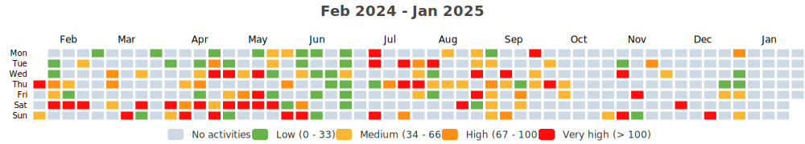

    

Since I began cycling `2600 days` ago on `22-09-2016`,
I had `655 cycling days`. 
I recorded a total distance of `23 223 km`
(`0.58` trips around the world 🌍 and
`0.060` trips to the moon 🌕),
an elevation of `68 783 m`
(`7.8` times Mount Everest 🏔)
and a total time of `1mo 2w 53m` 🎉

That's a daily average of `9 km`,
a weekly average of `62 km` and a
monthly average of `270 km` 🐣

I burned `534130 calories` doing so, that's about `1 978` pizza slices 🍕

---

<kbd><a href="#weekly-distances">Weekly distances</a></kbd> |
<kbd><a href="#activities">Activities</a></kbd> |
<kbd><a href="#monthly-stats">Monthly stats</a></kbd> |
<kbd><a href="#activity-heatmap">Activity heatmap</a></kbd> |
<kbd><a href="#stats-per-weekday">Stats per weekday</a></kbd> |
<kbd><a href="#daytime-stats">Daytime stats</a></kbd> |
<kbd><a href="#stats-per-bike">Stats per bike</a></kbd> |
<kbd><a href="#best-power-outputs-over-time">Power outputs</a></kbd> |
<kbd><a href="#eddington-chart">Eddington</a></kbd> |
<kbd><a href="#completed-challenges">Completed challenges</a></kbd>

## Weekly distances

## Activities

<table>
    <tr>
        <th></th>
        <th></th>
        <th align="center"></th>
        <th align="center"></th>
        <th align="center"></th>
        <th align="center"></th>
        <th align="center"></th>
        <th align="center"></th>
    </tr>
            <tr>
            <td>02-11-23</td>
            <td>
                
                <a href="https://www.strava.com/activities/10151512689" title="Kcal: 622 | Gear: None ">Cyclo Boys 🟡⚫</a>
            </td>
            <td align="center">24 km</td>
            <td align="center">0 m</td>
            <td align="center">41:36</td>
            <td align="center">223 w</td>
            <td align="center">34.5 km/h</td>
            <td align="center">n/a</td>
        </tr>
            <tr>
            <td>30-10-23</td>
            <td>
                
                <a href="https://www.strava.com/activities/10130244572" title="Kcal: 1964 | Gear: Kona Honzo MTB ">Vlaamse Ardennen MTB</a>
            </td>
            <td align="center">58 km</td>
            <td align="center">1138 m</td>
            <td align="center">3:49:30</td>
            <td align="center">155 w</td>
            <td align="center">15.1 km/h</td>
            <td align="center">139</td>
        </tr>
            <tr>
            <td>28-10-23</td>
            <td>
                
                <a href="https://www.strava.com/activities/10118346743" title="Kcal: 1328 | Gear: None ">Steershop x Cannondale Tes...</a>
            </td>
            <td align="center">50 km</td>
            <td align="center">89 m</td>
            <td align="center">2:11:21</td>
            <td align="center">105 w</td>
            <td align="center">22.9 km/h</td>
            <td align="center">146</td>
        </tr>
            <tr>
            <td>26-10-23</td>
            <td>
                
                <a href="https://www.strava.com/activities/10109867861" title="Kcal: 462 | Gear: Bianchi Impulso 105 ">Spinning met Beckham part....</a>
            </td>
            <td align="center">21 km</td>
            <td align="center">0 m</td>
            <td align="center">40:01</td>
            <td align="center">n/a</td>
            <td align="center">32.1 km/h</td>
            <td align="center">142</td>
        </tr>
            <tr>
            <td>23-10-23</td>
            <td>
                
                <a href="https://www.strava.com/activities/10092208695" title="Kcal: 673 | Gear: Bianchi Impulso 105 ">Fietsen met Beckham ⚽</a>
            </td>
            <td align="center">40 km</td>
            <td align="center">0 m</td>
            <td align="center">1:10:04</td>
            <td align="center">n/a</td>
            <td align="center">34.4 km/h</td>
            <td align="center">135</td>
        </tr>
        </table>

    
Older activities

    <table>
        <tr>
            <th></th>
            <th></th>
            <th align="center"></th>
            <th align="center"></th>
            <th align="center"></th>
            <th align="center"></th>
            <th align="center"></th>
            <th align="center"></th>
        </tr>
                    <tr>
                <td>14-10-23</td>
                <td>
                    
                    <a href="https://www.strava.com/activities/10036960207" title="Kcal: 265 | Gear: State Bicycle Rutherford 3.0 ">Great Bruges Half Preps 💇📝🔌⌚</a>
                </td>
                <td align="center">15 km</td>
                <td align="center">27 m</td>
                <td align="center">44:25</td>
                <td align="center">89 w</td>
                <td align="center">20 km/h</td>
                <td align="center">n/a</td>
            </tr>
                    <tr>
                <td>05-10-23</td>
                <td>
                    
                    <a href="https://www.strava.com/activities/9983948848" title="Kcal: 372 | Gear: Bianchi Impulso 105 ">Late Night Spin 🥵</a>
                </td>
                <td align="center">21 km</td>
                <td align="center">0 m</td>
                <td align="center">30:01</td>
                <td align="center">n/a</td>
                <td align="center">41.9 km/h</td>
                <td align="center">149</td>
            </tr>
                    <tr>
                <td>04-10-23</td>
                <td>
                    
                    <a href="https://www.strava.com/activities/9973210742" title="Kcal: n/a | Gear: None ">Morning 🌅 Ride @ Cyclo Stu...</a>
                </td>
                <td align="center">29 km</td>
                <td align="center">0 m</td>
                <td align="center">50:37</td>
                <td align="center">n/a</td>
                <td align="center">33.8 km/h</td>
                <td align="center">n/a</td>
            </tr>
                    <tr>
                <td>02-10-23</td>
                <td>
                    
                    <a href="https://www.strava.com/activities/9964380866" title="Kcal: 242 | Gear: Bianchi Impulso 105 ">Losrijden op de rollen</a>
                </td>
                <td align="center">20 km</td>
                <td align="center">0 m</td>
                <td align="center">41:40</td>
                <td align="center">n/a</td>
                <td align="center">29.5 km/h</td>
                <td align="center">108</td>
            </tr>
                    <tr>
                <td>28-09-23</td>
                <td>
                    
                    <a href="https://www.strava.com/activities/9939026032" title="Kcal: 1877 | Gear: Ridley Fenix ">WW 👷🏻‍♂️</a>
                </td>
                <td align="center">83 km</td>
                <td align="center">96 m</td>
                <td align="center">2:52:44</td>
                <td align="center">130 w</td>
                <td align="center">28.9 km/h</td>
                <td align="center">144</td>
            </tr>
                    <tr>
                <td>23-09-23</td>
                <td>
                    
                    <a href="https://www.strava.com/activities/9904019214" title="Kcal: 619 | Gear: Bianchi Impulso 105 ">SHAQ🏀</a>
                </td>
                <td align="center">43 km</td>
                <td align="center">0 m</td>
                <td align="center">1:19:05</td>
                <td align="center">n/a</td>
                <td align="center">32.8 km/h</td>
                <td align="center">127</td>
            </tr>
                    <tr>
                <td>17-09-23</td>
                <td>
                    
                    <a href="https://www.strava.com/activities/9869184128" title="Kcal: 424 | Gear: State Bicycle Rutherford 3.0 ">🪪🔙 + fietsentellingen mani...</a>
                </td>
                <td align="center">21 km</td>
                <td align="center">30 m</td>
                <td align="center">1:11:04</td>
                <td align="center">68 w</td>
                <td align="center">17.9 km/h</td>
                <td align="center">109</td>
            </tr>
                    <tr>
                <td>13-09-23</td>
                <td>
                    
                    <a href="https://www.strava.com/activities/9842327396" title="Kcal: 1877 | Gear: Ridley Fenix ">🌙🚴🚴👷🏻‍♂️</a>
                </td>
                <td align="center">82 km</td>
                <td align="center">102 m</td>
                <td align="center">2:46:14</td>
                <td align="center">144 w</td>
                <td align="center">29.4 km/h</td>
                <td align="center">145</td>
            </tr>
                    <tr>
                <td>10-09-23</td>
                <td>
                    
                    <a href="https://www.strava.com/activities/9824125966" title="Kcal: 359 | Gear: State Bicycle Rutherford 3.0 ">👵👴</a>
                </td>
                <td align="center">16 km</td>
                <td align="center">25 m</td>
                <td align="center">45:39</td>
                <td align="center">79 w</td>
                <td align="center">20.8 km/h</td>
                <td align="center">120</td>
            </tr>
                    <tr>
                <td>10-09-23</td>
                <td>
                    
                    <a href="https://www.strava.com/activities/9820269484" title="Kcal: 1376 | Gear: Ridley Fenix ">Ardooie check ✅</a>
                </td>
                <td align="center">60 km</td>
                <td align="center">134 m</td>
                <td align="center">2:04:04</td>
                <td align="center">143 w</td>
                <td align="center">29.1 km/h</td>
                <td align="center">149</td>
            </tr>
                    <tr>
                <td>08-09-23</td>
                <td>
                    
                    <a href="https://www.strava.com/activities/9809317165" title="Kcal: 1862 | Gear: Ridley Fenix ">🎑🌄☀️👷‍♀️</a>
                </td>
                <td align="center">80 km</td>
                <td align="center">91 m</td>
                <td align="center">2:54:11</td>
                <td align="center">123 w</td>
                <td align="center">27.6 km/h</td>
                <td align="center">145</td>
            </tr>
                    <tr>
                <td>04-09-23</td>
                <td>
                    
                    <a href="https://www.strava.com/activities/9780690661" title="Kcal: 1609 | Gear: Kona Honzo MTB ">D3: Naar de Citadelle de N...</a>
                </td>
                <td align="center">52 km</td>
                <td align="center">820 m</td>
                <td align="center">3:16:45</td>
                <td align="center">153 w</td>
                <td align="center">15.9 km/h</td>
                <td align="center">132</td>
            </tr>
                    <tr>
                <td>03-09-23</td>
                <td>
                    
                    <a href="https://www.strava.com/activities/9776681201" title="Kcal: 2270 | Gear: Kona Honzo MTB ">D2: Ruben heeft een 🐁 dood...</a>
                </td>
                <td align="center">79 km</td>
                <td align="center">950 m</td>
                <td align="center">4:42:13</td>
                <td align="center">144 w</td>
                <td align="center">16.7 km/h</td>
                <td align="center">130</td>
            </tr>
                    <tr>
                <td>02-09-23</td>
                <td>
                    
                    <a href="https://www.strava.com/activities/9769310820" title="Kcal: 3405 | Gear: Kona Honzo MTB ">D1: Langs Dolmens, Menhirs...</a>
                </td>
                <td align="center">81 km</td>
                <td align="center">1424 m</td>
                <td align="center">5:04:06</td>
                <td align="center">167 w</td>
                <td align="center">16 km/h</td>
                <td align="center">n/a</td>
            </tr>
                    <tr>
                <td>28-08-23</td>
                <td>
                    
                    <a href="https://www.strava.com/activities/9738763528" title="Kcal: 395 | Gear: Bianchi Impulso 105 ">Losrijden op de rollen met...</a>
                </td>
                <td align="center">27 km</td>
                <td align="center">0 m</td>
                <td align="center">45:47</td>
                <td align="center">n/a</td>
                <td align="center">34.8 km/h</td>
                <td align="center">125</td>
            </tr>
                    <tr>
                <td>27-08-23</td>
                <td>
                    
                    <a href="https://www.strava.com/activities/9731524995" title="Kcal: 499 | Gear: Ridley Fenix ">Mr. T Triathlon 🚴‍♂️🚴‍♂️🚴‍...</a>
                </td>
                <td align="center">21 km</td>
                <td align="center">33 m</td>
                <td align="center">35:00</td>
                <td align="center">234 w</td>
                <td align="center">35.5 km/h</td>
                <td align="center">164</td>
            </tr>
                    <tr>
                <td>19-08-23</td>
                <td>
                    
                    <a href="https://www.strava.com/activities/9678008278" title="Kcal: 2429 | Gear: Ridley Fenix ">Zuid-West-Vlaanderen afwer...</a>
                </td>
                <td align="center">101 km</td>
                <td align="center">156 m</td>
                <td align="center">3:18:01</td>
                <td align="center">161 w</td>
                <td align="center">30.7 km/h</td>
                <td align="center">160</td>
            </tr>
                    <tr>
                <td>15-08-23</td>
                <td>
                    
                    <a href="https://www.strava.com/activities/9655019324" title="Kcal: 250 | Gear: State Bicycle Rutherford 3.0 ">Naar uus</a>
                </td>
                <td align="center">10 km</td>
                <td align="center">13 m</td>
                <td align="center">27:51</td>
                <td align="center">71 w</td>
                <td align="center">21.1 km/h</td>
                <td align="center">123</td>
            </tr>
                    <tr>
                <td>15-08-23</td>
                <td>
                    
                    <a href="https://www.strava.com/activities/9653280291" title="Kcal: 262 | Gear: State Bicycle Rutherford 3.0 ">🚴‍♂️⏩🏊‍♂️</a>
                </td>
                <td align="center">9 km</td>
                <td align="center">22 m</td>
                <td align="center">22:11</td>
                <td align="center">100 w</td>
                <td align="center">24.2 km/h</td>
                <td align="center">140</td>
            </tr>
                    <tr>
                <td>13-08-23</td>
                <td>
                    
                    <a href="https://www.strava.com/activities/9641426983" title="Kcal: 214 | Gear: State Bicycle Rutherford 3.0 ">Zomerbar J@KK met Renée</a>
                </td>
                <td align="center">11 km</td>
                <td align="center">15 m</td>
                <td align="center">41:14</td>
                <td align="center">46 w</td>
                <td align="center">16.2 km/h</td>
                <td align="center">99</td>
            </tr>
                    <tr>
                <td>12-08-23</td>
                <td>
                    
                    <a href="https://www.strava.com/activities/9632023279" title="Kcal: 1835 | Gear: Ridley Fenix ">Toeroet</a>
                </td>
                <td align="center">66 km</td>
                <td align="center">178 m</td>
                <td align="center">2:21:20</td>
                <td align="center">143 w</td>
                <td align="center">27.9 km/h</td>
                <td align="center">158</td>
            </tr>
                    <tr>
                <td>10-08-23</td>
                <td>
                    
                    <a href="https://www.strava.com/activities/9617675939" title="Kcal: 1042 | Gear: Ridley Fenix ">Wa data gaan migreren 👷‍♂️</a>
                </td>
                <td align="center">41 km</td>
                <td align="center">48 m</td>
                <td align="center">1:27:32</td>
                <td align="center">123 w</td>
                <td align="center">27.8 km/h</td>
                <td align="center">152</td>
            </tr>
                    <tr>
                <td>09-08-23</td>
                <td>
                    
                    <a href="https://www.strava.com/activities/9614552100" title="Kcal: 1031 | Gear: Ridley Fenix ">Gedaan met Arbeiten 👷‍♂️ 🐀</a>
                </td>
                <td align="center">43 km</td>
                <td align="center">55 m</td>
                <td align="center">1:34:30</td>
                <td align="center">120 w</td>
                <td align="center">27.3 km/h</td>
                <td align="center">143</td>
            </tr>
                    <tr>
                <td>18-07-23</td>
                <td>
                    
                    <a href="https://www.strava.com/activities/9474393290" title="Kcal: 270 | Gear: State Bicycle Rutherford 3.0 ">Pré✈️🛒</a>
                </td>
                <td align="center">12 km</td>
                <td align="center">22 m</td>
                <td align="center">35:25</td>
                <td align="center">82 w</td>
                <td align="center">20.7 km/h</td>
                <td align="center">108</td>
            </tr>
                    <tr>
                <td>17-07-23</td>
                <td>
                    
                    <a href="https://www.strava.com/activities/9470075268" title="Kcal: 1855 | Gear: Ridley Fenix ">Kakwind Commute👷</a>
                </td>
                <td align="center">84 km</td>
                <td align="center">107 m</td>
                <td align="center">3:00:30</td>
                <td align="center">129 w</td>
                <td align="center">27.9 km/h</td>
                <td align="center">141</td>
            </tr>
                    <tr>
                <td>16-07-23</td>
                <td>
                    
                    <a href="https://www.strava.com/activities/9460482267" title="Kcal: 963 | Gear: Ridley Fenix ">Ridley doop 😍😍😍</a>
                </td>
                <td align="center">51 km</td>
                <td align="center">136 m</td>
                <td align="center">2:01:56</td>
                <td align="center">118 w</td>
                <td align="center">25.3 km/h</td>
                <td align="center">128</td>
            </tr>
                    <tr>
                <td>13-07-23</td>
                <td>
                    
                    <a href="https://www.strava.com/activities/9446981398" title="Kcal: 559 | Gear: State Bicycle Rutherford 3.0 ">🎾</a>
                </td>
                <td align="center">21 km</td>
                <td align="center">34 m</td>
                <td align="center">1:05:37</td>
                <td align="center">82 w</td>
                <td align="center">19.3 km/h</td>
                <td align="center">124</td>
            </tr>
                    <tr>
                <td>08-07-23</td>
                <td>
                    
                    <a href="https://www.strava.com/activities/9414259135" title="Kcal: n/a | Gear: Bianchi Impulso 105 ">👶🏻🚴‍♂️👶🏻</a>
                </td>
                <td align="center">30 km</td>
                <td align="center">0 m</td>
                <td align="center">1:00:00</td>
                <td align="center">n/a</td>
                <td align="center">30 km/h</td>
                <td align="center">n/a</td>
            </tr>
                    <tr>
                <td>01-07-23</td>
                <td>
                    
                    <a href="https://www.strava.com/activities/9380312667" title="Kcal: 879 | Gear: State Bicycle Rutherford 3.0 ">🚑</a>
                </td>
                <td align="center">23 km</td>
                <td align="center">20 m</td>
                <td align="center">1:00:53</td>
                <td align="center">121 w</td>
                <td align="center">22.3 km/h</td>
                <td align="center">107</td>
            </tr>
                    <tr>
                <td>27-06-23</td>
                <td>
                    
                    <a href="https://www.strava.com/activities/9345308377" title="Kcal: 1510 | Gear: Bianchi Impulso 105 ">Commuten met Flandrien Rob...</a>
                </td>
                <td align="center">81 km</td>
                <td align="center">111 m</td>
                <td align="center">3:00:41</td>
                <td align="center">120 w</td>
                <td align="center">27 km/h</td>
                <td align="center">130</td>
            </tr>
                    <tr>
                <td>19-06-23</td>
                <td>
                    
                    <a href="https://www.strava.com/activities/9297334118" title="Kcal: 166 | Gear: Bianchi Impulso 105 ">Losrijden2</a>
                </td>
                <td align="center">9 km</td>
                <td align="center">13 m</td>
                <td align="center">24:20</td>
                <td align="center">91 w</td>
                <td align="center">21.8 km/h</td>
                <td align="center">112</td>
            </tr>
                    <tr>
                <td>19-06-23</td>
                <td>
                    
                    <a href="https://www.strava.com/activities/9297035373" title="Kcal: 192 | Gear: Bianchi Impulso 105 ">Losrijden1</a>
                </td>
                <td align="center">9 km</td>
                <td align="center">14 m</td>
                <td align="center">23:36</td>
                <td align="center">101 w</td>
                <td align="center">23.5 km/h</td>
                <td align="center">119</td>
            </tr>
                    <tr>
                <td>18-06-23</td>
                <td>
                    
                    <a href="https://www.strava.com/activities/9290424418" title="Kcal: 1133 | Gear: Bianchi Impulso 105 ">Kwart-triathlon Kortrijk 🚴‍♂️</a>
                </td>
                <td align="center">44 km</td>
                <td align="center">252 m</td>
                <td align="center">1:23:51</td>
                <td align="center">192 w</td>
                <td align="center">31.1 km/h</td>
                <td align="center">163</td>
            </tr>
                    <tr>
                <td>17-06-23</td>
                <td>
                    
                    <a href="https://www.strava.com/activities/9281464985" title="Kcal: 581 | Gear: Bianchi Impulso 105 ">Bijna op mijn muil geklets...</a>
                </td>
                <td align="center">25 km</td>
                <td align="center">145 m</td>
                <td align="center">1:02:53</td>
                <td align="center">123 w</td>
                <td align="center">24.2 km/h</td>
                <td align="center">136</td>
            </tr>
                    <tr>
                <td>14-06-23</td>
                <td>
                    
                    <a href="https://www.strava.com/activities/9266802391" title="Kcal: n/a | Gear: Bianchi Impulso 105 ">3 primers en 2 drempels, h...</a>
                </td>
                <td align="center">28 km</td>
                <td align="center">0 m</td>
                <td align="center">51:00</td>
                <td align="center">n/a</td>
                <td align="center">33 km/h</td>
                <td align="center">n/a</td>
            </tr>
                    <tr>
                <td>11-06-23</td>
                <td>
                    
                    <a href="https://www.strava.com/activities/9248193231" title="Kcal: n/a | Gear: Bianchi Impulso 105 ">SHAQ🏀</a>
                </td>
                <td align="center">33 km</td>
                <td align="center">0 m</td>
                <td align="center">1:00:00</td>
                <td align="center">n/a</td>
                <td align="center">33 km/h</td>
                <td align="center">n/a</td>
            </tr>
                    <tr>
                <td>10-06-23</td>
                <td>
                    
                    <a href="https://www.strava.com/activities/9238613489" title="Kcal: 2708 | Gear: Bianchi Impulso 105 ">DONKNL 🇳🇱</a>
                </td>
                <td align="center">112 km</td>
                <td align="center">140 m</td>
                <td align="center">4:00:33</td>
                <td align="center">137 w</td>
                <td align="center">27.9 km/h</td>
                <td align="center">143</td>
            </tr>
                    <tr>
                <td>06-06-23</td>
                <td>
                    
                    <a href="https://www.strava.com/activities/9214935834" title="Kcal: 1017 | Gear: Bianchi Impulso 105 ">Heiebree</a>
                </td>
                <td align="center">44 km</td>
                <td align="center">42 m</td>
                <td align="center">1:27:49</td>
                <td align="center">167 w</td>
                <td align="center">30.1 km/h</td>
                <td align="center">149</td>
            </tr>
                    <tr>
                <td>03-06-23</td>
                <td>
                    
                    <a href="https://www.strava.com/activities/9195310628" title="Kcal: 1010 | Gear: Bianchi Impulso 105 ">World Bicycle Day 2023</a>
                </td>
                <td align="center">44 km</td>
                <td align="center">103 m</td>
                <td align="center">1:30:06</td>
                <td align="center">155 w</td>
                <td align="center">29.4 km/h</td>
                <td align="center">148</td>
            </tr>
                    <tr>
                <td>01-06-23</td>
                <td>
                    
                    <a href="https://www.strava.com/activities/9184733496" title="Kcal: 555 | Gear: Kona Honzo MTB ">Nachtwacht 🎵✝️🦊🦇🦇🦇🐇🐇🐇🐇🔦</a>
                </td>
                <td align="center">20 km</td>
                <td align="center">29 m</td>
                <td align="center">1:01:53</td>
                <td align="center">159 w</td>
                <td align="center">18.9 km/h</td>
                <td align="center">131</td>
            </tr>
                    <tr>
                <td>29-05-23</td>
                <td>
                    
                    <a href="https://www.strava.com/activities/9165201967" title="Kcal: 551 | Gear: Kona Honzo MTB ">🐎🫏🐄🐏🐑🦅🐦‍⬛🦆</a>
                </td>
                <td align="center">23 km</td>
                <td align="center">41 m</td>
                <td align="center">1:03:30</td>
                <td align="center">192 w</td>
                <td align="center">21.3 km/h</td>
                <td align="center">130</td>
            </tr>
                    <tr>
                <td>28-05-23</td>
                <td>
                    
                    <a href="https://www.strava.com/activities/9156918947" title="Kcal: 1060 | Gear: Bianchi Impulso 105 ">FTP test ✅</a>
                </td>
                <td align="center">55 km</td>
                <td align="center">89 m</td>
                <td align="center">1:52:10</td>
                <td align="center">158 w</td>
                <td align="center">29.6 km/h</td>
                <td align="center">144</td>
            </tr>
                    <tr>
                <td>25-05-23</td>
                <td>
                    
                    <a href="https://www.strava.com/activities/9140546337" title="Kcal: 659 | Gear: Bianchi Impulso 105 ">🚇</a>
                </td>
                <td align="center">27 km</td>
                <td align="center">57 m</td>
                <td align="center">53:54</td>
                <td align="center">161 w</td>
                <td align="center">30.6 km/h</td>
                <td align="center">151</td>
            </tr>
                    <tr>
                <td>21-05-23</td>
                <td>
                    
                    <a href="https://www.strava.com/activities/9111780855" title="Kcal: 970 | Gear: Bianchi Impulso 105 ">Losrijden</a>
                </td>
                <td align="center">52 km</td>
                <td align="center">71 m</td>
                <td align="center">2:02:44</td>
                <td align="center">114 w</td>
                <td align="center">25.5 km/h</td>
                <td align="center">130</td>
            </tr>
                    <tr>
                <td>20-05-23</td>
                <td>
                    
                    <a href="https://www.strava.com/activities/9108039084" title="Kcal: 2616 | Gear: Bianchi Impulso 105 ">Century voor KOTK 2023 met...</a>
                </td>
                <td align="center">158 km</td>
                <td align="center">543 m</td>
                <td align="center">5:54:42</td>
                <td align="center">128 w</td>
                <td align="center">26.8 km/h</td>
                <td align="center">125</td>
            </tr>
                    <tr>
                <td>17-05-23</td>
                <td>
                    
                    <a href="https://www.strava.com/activities/9089174560" title="Kcal: 907 | Gear: Bianchi Impulso 105 ">👷</a>
                </td>
                <td align="center">40 km</td>
                <td align="center">65 m</td>
                <td align="center">1:22:53</td>
                <td align="center">145 w</td>
                <td align="center">29.2 km/h</td>
                <td align="center">148</td>
            </tr>
                    <tr>
                <td>13-05-23</td>
                <td>
                    
                    <a href="https://www.strava.com/activities/9061831102" title="Kcal: 1615 | Gear: Bianchi Impulso 105 ">Bijna-afscheid van de Bian...</a>
                </td>
                <td align="center">70 km</td>
                <td align="center">163 m</td>
                <td align="center">2:31:04</td>
                <td align="center">141 w</td>
                <td align="center">28 km/h</td>
                <td align="center">150</td>
            </tr>
                    <tr>
                <td>10-05-23</td>
                <td>
                    
                    <a href="https://www.strava.com/activities/9047673457" title="Kcal: 1449 | Gear: Kona Honzo MTB ">Op pad met den Bijstandt</a>
                </td>
                <td align="center">53 km</td>
                <td align="center">39 m</td>
                <td align="center">2:33:13</td>
                <td align="center">170 w</td>
                <td align="center">20.6 km/h</td>
                <td align="center">141</td>
            </tr>
                    <tr>
                <td>09-05-23</td>
                <td>
                    
                    <a href="https://www.strava.com/activities/9042086461" title="Kcal: n/a | Gear: Bianchi Impulso 105 ">Tacx test met Saul Goodman 👌</a>
                </td>
                <td align="center">37 km</td>
                <td align="center">0 m</td>
                <td align="center">1:08:00</td>
                <td align="center">n/a</td>
                <td align="center">33 km/h</td>
                <td align="center">n/a</td>
            </tr>
                    <tr>
                <td>05-05-23</td>
                <td>
                    
                    <a href="https://www.strava.com/activities/9013450842" title="Kcal: 670 | Gear: Bianchi Impulso 105 ">Met vallen en opstaan 👷</a>
                </td>
                <td align="center">40 km</td>
                <td align="center">44 m</td>
                <td align="center">1:40:17</td>
                <td align="center">91 w</td>
                <td align="center">24.2 km/h</td>
                <td align="center">118</td>
            </tr>
            </table>

## Monthly stats

<table>
    <thead>
    <tr>
        <th>&nbsp;&nbsp;&nbsp;&nbsp;&nbsp;</th>
        <th># of rides</th>
        <th align="center"></th>
        <th align="center"></th>
        <th align="center"></th>
        <th align="center"></th>
        <th align="center"></th>
    </tr>
    </thead>
    <tbody>
            <tr>
            <td align="center">November 2023</td>
            <td align="center">1</td>
            <td align="center">24 km</td>
            <td>
                <ul>
                                            <li><b>Other</b>: 24 km</li>
                                    </ul>
            </td>
            <td align="center">0 m</td>
            <td align="center">41m</td>
            <td align="center">6</td>
        </tr>
            <tr>
            <td align="center">October 2023</td>
            <td align="center">8</td>
            <td align="center">254 km</td>
            <td>
                <ul>
                                            <li><b>Bianchi Impulso 105</b>: 102 km</li>
                                            <li><b>Other</b>: 79 km</li>
                                            <li><b>Kona Honzo MTB</b>: 58 km</li>
                                            <li><b>State Bicycle Rutherford 3.0</b>: 15 km</li>
                                    </ul>
            </td>
            <td align="center">1 254 m</td>
            <td align="center">10h 37m</td>
            <td align="center">0</td>
        </tr>
            <tr>
            <td align="center">September 2023</td>
            <td align="center">10</td>
            <td align="center">597 km</td>
            <td>
                <ul>
                                            <li><b>Ridley Fenix</b>: 305 km</li>
                                            <li><b>Kona Honzo MTB</b>: 212 km</li>
                                            <li><b>Bianchi Impulso 105</b>: 43 km</li>
                                            <li><b>State Bicycle Rutherford 3.0</b>: 37 km</li>
                                    </ul>
            </td>
            <td align="center">3 672 m</td>
            <td align="center">1d 2h 56m</td>
            <td align="center">0</td>
        </tr>
            <tr>
            <td align="center">August 2023</td>
            <td align="center">9</td>
            <td align="center">329 km</td>
            <td>
                <ul>
                                            <li><b>Ridley Fenix</b>: 272 km</li>
                                            <li><b>State Bicycle Rutherford 3.0</b>: 30 km</li>
                                            <li><b>Bianchi Impulso 105</b>: 27 km</li>
                                    </ul>
            </td>
            <td align="center">520 m</td>
            <td align="center">11h 33m</td>
            <td align="center">0</td>
        </tr>
            <tr>
            <td align="center">July 2023</td>
            <td align="center">6</td>
            <td align="center">221 km</td>
            <td>
                <ul>
                                            <li><b>Ridley Fenix</b>: 135 km</li>
                                            <li><b>State Bicycle Rutherford 3.0</b>: 56 km</li>
                                            <li><b>Bianchi Impulso 105</b>: 30 km</li>
                                    </ul>
            </td>
            <td align="center">319 m</td>
            <td align="center">8h 44m</td>
            <td align="center">0</td>
        </tr>
            <tr>
            <td align="center">June 2023</td>
            <td align="center">11</td>
            <td align="center">449 km</td>
            <td>
                <ul>
                                            <li><b>Bianchi Impulso 105</b>: 429 km</li>
                                            <li><b>Kona Honzo MTB</b>: 20 km</li>
                                    </ul>
            </td>
            <td align="center">849 m</td>
            <td align="center">16h 6m</td>
            <td align="center">0</td>
        </tr>
            <tr>
            <td align="center">May 2023</td>
            <td align="center">12</td>
            <td align="center">637 km</td>
            <td>
                <ul>
                                            <li><b>Bianchi Impulso 105</b>: 520 km</li>
                                            <li><b>Kona Honzo MTB</b>: 117 km</li>
                                    </ul>
            </td>
            <td align="center">1 192 m</td>
            <td align="center">1d 19m</td>
            <td align="center">0</td>
        </tr>
            <tr>
            <td align="center">April 2023</td>
            <td align="center">14</td>
            <td align="center">601 km</td>
            <td>
                <ul>
                                            <li><b>Bianchi Impulso 105</b>: 489 km</li>
                                            <li><b>Kona Honzo MTB</b>: 69 km</li>
                                            <li><b>State Bicycle Rutherford 3.0</b>: 43 km</li>
                                    </ul>
            </td>
            <td align="center">2 013 m</td>
            <td align="center">1d 43m</td>
            <td align="center">0</td>
        </tr>
            <tr>
            <td align="center">March 2023</td>
            <td align="center">8</td>
            <td align="center">237 km</td>
            <td>
                <ul>
                                            <li><b>Bianchi Impulso 105</b>: 129 km</li>
                                            <li><b>Other</b>: 41 km</li>
                                            <li><b>State Bicycle Rutherford 3.0</b>: 37 km</li>
                                            <li><b>Kona Honzo MTB</b>: 30 km</li>
                                    </ul>
            </td>
            <td align="center">366 m</td>
            <td align="center">9h 20m</td>
            <td align="center">0</td>
        </tr>
            <tr>
            <td align="center">February 2023</td>
            <td align="center">13</td>
            <td align="center">310 km</td>
            <td>
                <ul>
                                            <li><b>Bianchi Impulso 105</b>: 207 km</li>
                                            <li><b>State Bicycle Rutherford 3.0</b>: 46 km</li>
                                            <li><b>Kona Honzo MTB</b>: 42 km</li>
                                            <li><b>Other</b>: 15 km</li>
                                    </ul>
            </td>
            <td align="center">484 m</td>
            <td align="center">12h 42m</td>
            <td align="center">0</td>
        </tr>
            <tr>
            <td align="center">January 2023</td>
            <td align="center">12</td>
            <td align="center">330 km</td>
            <td>
                <ul>
                                            <li><b>Kona Honzo MTB</b>: 114 km</li>
                                            <li><b>Other</b>: 110 km</li>
                                            <li><b>State Bicycle Rutherford 3.0</b>: 76 km</li>
                                            <li><b>Bianchi Impulso 105</b>: 30 km</li>
                                    </ul>
            </td>
            <td align="center">404 m</td>
            <td align="center">13h 44m</td>
            <td align="center">0</td>
        </tr>
            <tr>
            <td align="center">December 2022</td>
            <td align="center">7</td>
            <td align="center">229 km</td>
            <td>
                <ul>
                                            <li><b>Kona Honzo MTB</b>: 146 km</li>
                                            <li><b>Bianchi Impulso 105</b>: 32 km</li>
                                            <li><b>Other</b>: 28 km</li>
                                            <li><b>State Bicycle Rutherford 3.0</b>: 23 km</li>
                                    </ul>
            </td>
            <td align="center">1 579 m</td>
            <td align="center">11h 17m</td>
            <td align="center">0</td>
        </tr>
            <tr>
            <td align="center">November 2022</td>
            <td align="center">7</td>
            <td align="center">173 km</td>
            <td>
                <ul>
                                            <li><b>Bianchi Impulso 105</b>: 67 km</li>
                                            <li><b>Kona Honzo MTB</b>: 54 km</li>
                                            <li><b>State Bicycle Rutherford 3.0</b>: 52 km</li>
                                    </ul>
            </td>
            <td align="center">665 m</td>
            <td align="center">7h 53m</td>
            <td align="center">0</td>
        </tr>
            <tr>
            <td align="center">October 2022</td>
            <td align="center">7</td>
            <td align="center">165 km</td>
            <td>
                <ul>
                                            <li><b>Kona Honzo MTB</b>: 93 km</li>
                                            <li><b>State Bicycle Rutherford 3.0</b>: 48 km</li>
                                            <li><b>Other</b>: 24 km</li>
                                    </ul>
            </td>
            <td align="center">219 m</td>
            <td align="center">8h 43m</td>
            <td align="center">0</td>
        </tr>
            <tr>
            <td align="center">September 2022</td>
            <td align="center">2</td>
            <td align="center">97 km</td>
            <td>
                <ul>
                                            <li><b>Other</b>: 97 km</li>
                                    </ul>
            </td>
            <td align="center">1 311 m</td>
            <td align="center">4h 25m</td>
            <td align="center">0</td>
        </tr>
            <tr>
            <td align="center">August 2022</td>
            <td align="center">3</td>
            <td align="center">120 km</td>
            <td>
                <ul>
                                            <li><b>Bianchi Impulso 105</b>: 90 km</li>
                                            <li><b>State Bicycle Rutherford 3.0</b>: 30 km</li>
                                    </ul>
            </td>
            <td align="center">135 m</td>
            <td align="center">4h 37m</td>
            <td align="center">0</td>
        </tr>
            <tr>
            <td align="center">July 2022</td>
            <td align="center">8</td>
            <td align="center">249 km</td>
            <td>
                <ul>
                                            <li><b>Bianchi Impulso 105</b>: 135 km</li>
                                            <li><b>State Bicycle Rutherford 3.0</b>: 63 km</li>
                                            <li><b>Kona Honzo MTB</b>: 51 km</li>
                                    </ul>
            </td>
            <td align="center">223 m</td>
            <td align="center">10h 16m</td>
            <td align="center">0</td>
        </tr>
            <tr>
            <td align="center">June 2022</td>
            <td align="center">6</td>
            <td align="center">193 km</td>
            <td>
                <ul>
                                            <li><b>Kona Honzo MTB</b>: 156 km</li>
                                            <li><b>State Bicycle Rutherford 3.0</b>: 37 km</li>
                                    </ul>
            </td>
            <td align="center">3 061 m</td>
            <td align="center">12h 23m</td>
            <td align="center">0</td>
        </tr>
            <tr>
            <td align="center">May 2022</td>
            <td align="center">15</td>
            <td align="center">266 km</td>
            <td>
                <ul>
                                            <li><b>State Bicycle Rutherford 3.0</b>: 231 km</li>
                                            <li><b>Kona Honzo MTB</b>: 35 km</li>
                                    </ul>
            </td>
            <td align="center">375 m</td>
            <td align="center">11h 53m</td>
            <td align="center">0</td>
        </tr>
            <tr>
            <td align="center">April 2022</td>
            <td align="center">15</td>
            <td align="center">317 km</td>
            <td>
                <ul>
                                            <li><b>Bianchi Impulso 105</b>: 129 km</li>
                                            <li><b>State Bicycle Rutherford 3.0</b>: 102 km</li>
                                            <li><b>Kona Honzo MTB</b>: 86 km</li>
                                    </ul>
            </td>
            <td align="center">423 m</td>
            <td align="center">14h 10m</td>
            <td align="center">0</td>
        </tr>
            <tr>
            <td align="center">March 2022</td>
            <td align="center">18</td>
            <td align="center">362 km</td>
            <td>
                <ul>
                                            <li><b>Kona Honzo MTB</b>: 134 km</li>
                                            <li><b>State Bicycle Rutherford 3.0</b>: 125 km</li>
                                            <li><b>Bianchi Impulso 105</b>: 103 km</li>
                                    </ul>
            </td>
            <td align="center">485 m</td>
            <td align="center">16h</td>
            <td align="center">0</td>
        </tr>
            <tr>
            <td align="center">February 2022</td>
            <td align="center">13</td>
            <td align="center">274 km</td>
            <td>
                <ul>
                                            <li><b>State Bicycle Rutherford 3.0</b>: 274 km</li>
                                    </ul>
            </td>
            <td align="center">386 m</td>
            <td align="center">11h 53m</td>
            <td align="center">0</td>
        </tr>
            <tr>
            <td align="center">January 2022</td>
            <td align="center">9</td>
            <td align="center">220 km</td>
            <td>
                <ul>
                                            <li><b>State Bicycle Rutherford 3.0</b>: 97 km</li>
                                            <li><b>Other</b>: 91 km</li>
                                            <li><b>Bianchi Impulso 105</b>: 32 km</li>
                                    </ul>
            </td>
            <td align="center">131 m</td>
            <td align="center">8h 50m</td>
            <td align="center">0</td>
        </tr>
            <tr>
            <td align="center">December 2021</td>
            <td align="center">10</td>
            <td align="center">321 km</td>
            <td>
                <ul>
                                            <li><b>State Bicycle Rutherford 3.0</b>: 231 km</li>
                                            <li><b>Specialized Crave MTB</b>: 90 km</li>
                                    </ul>
            </td>
            <td align="center">491 m</td>
            <td align="center">15h</td>
            <td align="center">0</td>
        </tr>
            <tr>
            <td align="center">November 2021</td>
            <td align="center">1</td>
            <td align="center">25 km</td>
            <td>
                <ul>
                                            <li><b>State Bicycle Rutherford 3.0</b>: 25 km</li>
                                    </ul>
            </td>
            <td align="center">0 m</td>
            <td align="center">50m</td>
            <td align="center">0</td>
        </tr>
            <tr>
            <td align="center">October 2021</td>
            <td align="center">2</td>
            <td align="center">58 km</td>
            <td>
                <ul>
                                            <li><b>Other</b>: 58 km</li>
                                    </ul>
            </td>
            <td align="center">0 m</td>
            <td align="center">2h</td>
            <td align="center">0</td>
        </tr>
            <tr>
            <td align="center">September 2021</td>
            <td align="center">15</td>
            <td align="center">506 km</td>
            <td>
                <ul>
                                            <li><b>Bianchi Impulso 105</b>: 204 km</li>
                                            <li><b>Specialized Crave MTB</b>: 200 km</li>
                                            <li><b>State Bicycle Rutherford 3.0</b>: 102 km</li>
                                    </ul>
            </td>
            <td align="center">1 774 m</td>
            <td align="center">23h 43m</td>
            <td align="center">0</td>
        </tr>
            <tr>
            <td align="center">August 2021</td>
            <td align="center">6</td>
            <td align="center">231 km</td>
            <td>
                <ul>
                                            <li><b>State Bicycle Rutherford 3.0</b>: 100 km</li>
                                            <li><b>Bianchi Impulso 105</b>: 77 km</li>
                                            <li><b>Specialized Crave MTB</b>: 54 km</li>
                                    </ul>
            </td>
            <td align="center">994 m</td>
            <td align="center">11h 4m</td>
            <td align="center">0</td>
        </tr>
            <tr>
            <td align="center">July 2021</td>
            <td align="center">10</td>
            <td align="center">195 km</td>
            <td>
                <ul>
                                            <li><b>State Bicycle Rutherford 3.0</b>: 184 km</li>
                                            <li><b>Bianchi Impulso 105</b>: 11 km</li>
                                    </ul>
            </td>
            <td align="center">275 m</td>
            <td align="center">9h 3m</td>
            <td align="center">0</td>
        </tr>
            <tr>
            <td align="center">June 2021</td>
            <td align="center">20</td>
            <td align="center">556 km</td>
            <td>
                <ul>
                                            <li><b>Specialized Crave MTB</b>: 283 km</li>
                                            <li><b>State Bicycle Rutherford 3.0</b>: 200 km</li>
                                            <li><b>Bianchi Impulso 105</b>: 73 km</li>
                                    </ul>
            </td>
            <td align="center">3 375 m</td>
            <td align="center">1d 3h 58m</td>
            <td align="center">0</td>
        </tr>
            <tr>
            <td align="center">May 2021</td>
            <td align="center">16</td>
            <td align="center">403 km</td>
            <td>
                <ul>
                                            <li><b>State Bicycle Rutherford 3.0</b>: 267 km</li>
                                            <li><b>Bianchi Impulso 105</b>: 136 km</li>
                                    </ul>
            </td>
            <td align="center">436 m</td>
            <td align="center">17h 19m</td>
            <td align="center">0</td>
        </tr>
            <tr>
            <td align="center">April 2021</td>
            <td align="center">19</td>
            <td align="center">358 km</td>
            <td>
                <ul>
                                            <li><b>State Bicycle Rutherford 3.0</b>: 234 km</li>
                                            <li><b>Bianchi Impulso 105</b>: 124 km</li>
                                    </ul>
            </td>
            <td align="center">479 m</td>
            <td align="center">15h 26m</td>
            <td align="center">0</td>
        </tr>
            <tr>
            <td align="center">March 2021</td>
            <td align="center">16</td>
            <td align="center">275 km</td>
            <td>
                <ul>
                                            <li><b>State Bicycle Rutherford 3.0</b>: 224 km</li>
                                            <li><b>Ridley Blast MTB</b>: 51 km</li>
                                    </ul>
            </td>
            <td align="center">324 m</td>
            <td align="center">12h 29m</td>
            <td align="center">0</td>
        </tr>
            <tr>
            <td align="center">February 2021</td>
            <td align="center">10</td>
            <td align="center">117 km</td>
            <td>
                <ul>
                                            <li><b>State Bicycle Rutherford 3.0</b>: 114 km</li>
                                            <li><b>Ridley Blast MTB</b>: 3 km</li>
                                    </ul>
            </td>
            <td align="center">127 m</td>
            <td align="center">5h 16m</td>
            <td align="center">0</td>
        </tr>
            <tr>
            <td align="center">January 2021</td>
            <td align="center">6</td>
            <td align="center">122 km</td>
            <td>
                <ul>
                                            <li><b>Ridley Blast MTB</b>: 61 km</li>
                                            <li><b>State Bicycle Rutherford 3.0</b>: 61 km</li>
                                    </ul>
            </td>
            <td align="center">148 m</td>
            <td align="center">5h 51m</td>
            <td align="center">0</td>
        </tr>
            <tr>
            <td align="center">December 2020</td>
            <td align="center">29</td>
            <td align="center">1 177 km</td>
            <td>
                <ul>
                                            <li><b>Bianchi Impulso 105</b>: 580 km</li>
                                            <li><b>State Bicycle Rutherford 3.0</b>: 361 km</li>
                                            <li><b>Ridley Blast MTB</b>: 236 km</li>
                                    </ul>
            </td>
            <td align="center">1 289 m</td>
            <td align="center">2d 43m</td>
            <td align="center">0</td>
        </tr>
            <tr>
            <td align="center">November 2020</td>
            <td align="center">35</td>
            <td align="center">1 319 km</td>
            <td>
                <ul>
                                            <li><b>Ridley Blast MTB</b>: 562 km</li>
                                            <li><b>Bianchi Impulso 105</b>: 476 km</li>
                                            <li><b>State Bicycle Rutherford 3.0</b>: 281 km</li>
                                    </ul>
            </td>
            <td align="center">1 470 m</td>
            <td align="center">2d 7h 34m</td>
            <td align="center">0</td>
        </tr>
            <tr>
            <td align="center">October 2020</td>
            <td align="center">23</td>
            <td align="center">758 km</td>
            <td>
                <ul>
                                            <li><b>Ridley Blast MTB</b>: 472 km</li>
                                            <li><b>State Bicycle Rutherford 3.0</b>: 181 km</li>
                                            <li><b>Bianchi Impulso 105</b>: 105 km</li>
                                    </ul>
            </td>
            <td align="center">880 m</td>
            <td align="center">1d 9h 26m</td>
            <td align="center">0</td>
        </tr>
            <tr>
            <td align="center">September 2020</td>
            <td align="center">25</td>
            <td align="center">998 km</td>
            <td>
                <ul>
                                            <li><b>Bianchi Impulso 105</b>: 658 km</li>
                                            <li><b>State Bicycle Rutherford 3.0</b>: 290 km</li>
                                            <li><b>Ridley Blast MTB</b>: 50 km</li>
                                    </ul>
            </td>
            <td align="center">3 418 m</td>
            <td align="center">1d 16h 42m</td>
            <td align="center">0</td>
        </tr>
            <tr>
            <td align="center">August 2020</td>
            <td align="center">12</td>
            <td align="center">508 km</td>
            <td>
                <ul>
                                            <li><b>Bianchi Impulso 105</b>: 266 km</li>
                                            <li><b>Ridley Blast MTB</b>: 189 km</li>
                                            <li><b>State Bicycle Rutherford 3.0</b>: 53 km</li>
                                    </ul>
            </td>
            <td align="center">8 082 m</td>
            <td align="center">1d 2h 15m</td>
            <td align="center">0</td>
        </tr>
            <tr>
            <td align="center">July 2020</td>
            <td align="center">18</td>
            <td align="center">718 km</td>
            <td>
                <ul>
                                            <li><b>State Bicycle Rutherford 3.0</b>: 427 km</li>
                                            <li><b>Bianchi Impulso 105</b>: 291 km</li>
                                    </ul>
            </td>
            <td align="center">1 084 m</td>
            <td align="center">1d 5h 46m</td>
            <td align="center">0</td>
        </tr>
            <tr>
            <td align="center">June 2020</td>
            <td align="center">22</td>
            <td align="center">909 km</td>
            <td>
                <ul>
                                            <li><b>Bianchi Impulso 105</b>: 551 km</li>
                                            <li><b>State Bicycle Rutherford 3.0</b>: 195 km</li>
                                            <li><b>Ridley Blast MTB</b>: 163 km</li>
                                    </ul>
            </td>
            <td align="center">2 562 m</td>
            <td align="center">1d 12h 40m</td>
            <td align="center">0</td>
        </tr>
            <tr>
            <td align="center">May 2020</td>
            <td align="center">24</td>
            <td align="center">1 053 km</td>
            <td>
                <ul>
                                            <li><b>Bianchi Impulso 105</b>: 632 km</li>
                                            <li><b>State Bicycle Rutherford 3.0</b>: 295 km</li>
                                            <li><b>Ridley Blast MTB</b>: 126 km</li>
                                    </ul>
            </td>
            <td align="center">1 766 m</td>
            <td align="center">1d 20h 8m</td>
            <td align="center">0</td>
        </tr>
            <tr>
            <td align="center">April 2020</td>
            <td align="center">19</td>
            <td align="center">1 043 km</td>
            <td>
                <ul>
                                            <li><b>Bianchi Impulso 105</b>: 777 km</li>
                                            <li><b>State Bicycle Rutherford 3.0</b>: 196 km</li>
                                            <li><b>Ridley Blast MTB</b>: 70 km</li>
                                    </ul>
            </td>
            <td align="center">1 793 m</td>
            <td align="center">1d 18h 34m</td>
            <td align="center">0</td>
        </tr>
            <tr>
            <td align="center">March 2020</td>
            <td align="center">24</td>
            <td align="center">959 km</td>
            <td>
                <ul>
                                            <li><b>Bianchi Impulso 105</b>: 716 km</li>
                                            <li><b>State Bicycle Rutherford 3.0</b>: 206 km</li>
                                            <li><b>Ridley Blast MTB</b>: 37 km</li>
                                    </ul>
            </td>
            <td align="center">2 048 m</td>
            <td align="center">1d 13h 20m</td>
            <td align="center">0</td>
        </tr>
            <tr>
            <td align="center">February 2020</td>
            <td align="center">7</td>
            <td align="center">194 km</td>
            <td>
                <ul>
                                            <li><b>State Bicycle Rutherford 3.0</b>: 141 km</li>
                                            <li><b>Ridley Blast MTB</b>: 53 km</li>
                                    </ul>
            </td>
            <td align="center">605 m</td>
            <td align="center">7h 59m</td>
            <td align="center">0</td>
        </tr>
            <tr>
            <td align="center">January 2020</td>
            <td align="center">19</td>
            <td align="center">404 km</td>
            <td>
                <ul>
                                            <li><b>State Bicycle Rutherford 3.0</b>: 222 km</li>
                                            <li><b>Ridley Blast MTB</b>: 182 km</li>
                                    </ul>
            </td>
            <td align="center">2 211 m</td>
            <td align="center">18h 46m</td>
            <td align="center">0</td>
        </tr>
            <tr>
            <td align="center">December 2019</td>
            <td align="center">7</td>
            <td align="center">156 km</td>
            <td>
                <ul>
                                            <li><b>State Bicycle Rutherford 3.0</b>: 102 km</li>
                                            <li><b>Ridley Blast MTB</b>: 54 km</li>
                                    </ul>
            </td>
            <td align="center">587 m</td>
            <td align="center">7h 42m</td>
            <td align="center">0</td>
        </tr>
            <tr>
            <td align="center">November 2019</td>
            <td align="center">15</td>
            <td align="center">266 km</td>
            <td>
                <ul>
                                            <li><b>State Bicycle Rutherford 3.0</b>: 134 km</li>
                                            <li><b>Ridley Blast MTB</b>: 132 km</li>
                                    </ul>
            </td>
            <td align="center">1 098 m</td>
            <td align="center">12h</td>
            <td align="center">0</td>
        </tr>
            <tr>
            <td align="center">October 2019</td>
            <td align="center">31</td>
            <td align="center">491 km</td>
            <td>
                <ul>
                                            <li><b>State Bicycle Rutherford 3.0</b>: 320 km</li>
                                            <li><b>Other</b>: 90 km</li>
                                            <li><b>Bianchi Impulso 105</b>: 81 km</li>
                                    </ul>
            </td>
            <td align="center">1 977 m</td>
            <td align="center">20h 26m</td>
            <td align="center">0</td>
        </tr>
            <tr>
            <td align="center">September 2019</td>
            <td align="center">22</td>
            <td align="center">652 km</td>
            <td>
                <ul>
                                            <li><b>State Bicycle Rutherford 3.0</b>: 370 km</li>
                                            <li><b>Bianchi Impulso 105</b>: 282 km</li>
                                    </ul>
            </td>
            <td align="center">2 324 m</td>
            <td align="center">1d 21h 46m</td>
            <td align="center">0</td>
        </tr>
            <tr>
            <td align="center">August 2019</td>
            <td align="center">13</td>
            <td align="center">431 km</td>
            <td>
                <ul>
                                            <li><b>State Bicycle Rutherford 3.0</b>: 241 km</li>
                                            <li><b>Bianchi Impulso 105</b>: 190 km</li>
                                    </ul>
            </td>
            <td align="center">1 580 m</td>
            <td align="center">16h 31m</td>
            <td align="center">0</td>
        </tr>
            <tr>
            <td align="center">July 2019</td>
            <td align="center">14</td>
            <td align="center">446 km</td>
            <td>
                <ul>
                                            <li><b>State Bicycle Rutherford 3.0</b>: 237 km</li>
                                            <li><b>Bianchi Impulso 105</b>: 188 km</li>
                                            <li><b>Other</b>: 21 km</li>
                                    </ul>
            </td>
            <td align="center">2 066 m</td>
            <td align="center">17h 52m</td>
            <td align="center">0</td>
        </tr>
            <tr>
            <td align="center">June 2019</td>
            <td align="center">14</td>
            <td align="center">460 km</td>
            <td>
                <ul>
                                            <li><b>State Bicycle Rutherford 3.0</b>: 337 km</li>
                                            <li><b>Bianchi Impulso 105</b>: 123 km</li>
                                    </ul>
            </td>
            <td align="center">1 944 m</td>
            <td align="center">18h 17m</td>
            <td align="center">0</td>
        </tr>
            <tr>
            <td align="center">May 2019</td>
            <td align="center">5</td>
            <td align="center">247 km</td>
            <td>
                <ul>
                                            <li><b>Bianchi Impulso 105</b>: 162 km</li>
                                            <li><b>State Bicycle Rutherford 3.0</b>: 85 km</li>
                                    </ul>
            </td>
            <td align="center">976 m</td>
            <td align="center">10h 11m</td>
            <td align="center">0</td>
        </tr>
            <tr>
            <td align="center">April 2019</td>
            <td align="center">2</td>
            <td align="center">71 km</td>
            <td>
                <ul>
                                            <li><b>Bianchi Impulso 105</b>: 50 km</li>
                                            <li><b>State Bicycle Rutherford 3.0</b>: 21 km</li>
                                    </ul>
            </td>
            <td align="center">138 m</td>
            <td align="center">2h 48m</td>
            <td align="center">0</td>
        </tr>
            <tr>
            <td align="center">March 2019</td>
            <td align="center">1</td>
            <td align="center">6 km</td>
            <td>
                <ul>
                                            <li><b>State Bicycle Rutherford 3.0</b>: 6 km</li>
                                    </ul>
            </td>
            <td align="center">12 m</td>
            <td align="center">14m</td>
            <td align="center">0</td>
        </tr>
            <tr>
            <td align="center">September 2018</td>
            <td align="center">2</td>
            <td align="center">57 km</td>
            <td>
                <ul>
                                            <li><b>Other</b>: 57 km</li>
                                    </ul>
            </td>
            <td align="center">125 m</td>
            <td align="center">2h 38m</td>
            <td align="center">0</td>
        </tr>
            <tr>
            <td align="center">June 2018</td>
            <td align="center">2</td>
            <td align="center">24 km</td>
            <td>
                <ul>
                                            <li><b>Other</b>: 24 km</li>
                                    </ul>
            </td>
            <td align="center">77 m</td>
            <td align="center">1h 21m</td>
            <td align="center">0</td>
        </tr>
            <tr>
            <td align="center">May 2018</td>
            <td align="center">1</td>
            <td align="center">12 km</td>
            <td>
                <ul>
                                            <li><b>Other</b>: 12 km</li>
                                    </ul>
            </td>
            <td align="center">29 m</td>
            <td align="center">1h 7m</td>
            <td align="center">0</td>
        </tr>
            <tr>
            <td align="center">May 2017</td>
            <td align="center">3</td>
            <td align="center">32 km</td>
            <td>
                <ul>
                                            <li><b>Other</b>: 32 km</li>
                                    </ul>
            </td>
            <td align="center">115 m</td>
            <td align="center">1h 19m</td>
            <td align="center">0</td>
        </tr>
            <tr>
            <td align="center">September 2016</td>
            <td align="center">1</td>
            <td align="center">11 km</td>
            <td>
                <ul>
                                            <li><b>Other</b>: 11 km</li>
                                    </ul>
            </td>
            <td align="center">38 m</td>
            <td align="center">37m</td>
            <td align="center">0</td>
        </tr>
        <tr>
        <td align="center" rowspan="3"><b>Totals</b></td>
        <td align="center"><b>Virtual / Indoor</b></td>
        <td align="center" colspan="2"><b>469 km</b></td>
        <td align="center"><b>0 m</b></td>
        <td align="center" colspan="2"><b>14h 25m</b></td>
    </tr>
    <tr>
        <td align="center"><b>Outside</b></td>
        <td align="center" colspan="2"><b>22 754 km</b></td>
        <td align="center"><b>68 783 m</b></td>
        <td align="center" colspan="2"><b>1mo 1w 6d 10h 27m</b></td>
    </tr>
    <tr>
        <td align="center"><b>Total</b></td>
        <td align="center" colspan="2"><b>23 223 km</b></td>
        <td align="center"><b>68 783 m</b></td>
        <td align="center" colspan="2"><b>1mo 2w 53m</b></td>
    </tr>
    </tbody>
</table>

## Activity heatmap

## Stats per weekday

<table>
    <thead>
    <tr>
        <th></th>
        <th># of rides</th>
        <th align="center"></th>
        <th align="center"></th>
        <th align="center"></th>
    </tr>
    </thead>
    <tbody>
            <tr>
            <td align="center">Monday</td>
            <td align="center">106</td>
            <td align="center">2 958 km</td>
            <td align="center">9 500 m</td>
            <td align="center">5d 13h 41m</td>
        </tr>
            <tr>
            <td align="center">Tuesday</td>
            <td align="center">100</td>
            <td align="center">2 499 km</td>
            <td align="center">5 254 m</td>
            <td align="center">4d 9h 53m</td>
        </tr>
            <tr>
            <td align="center">Wednesday</td>
            <td align="center">127</td>
            <td align="center">3 947 km</td>
            <td align="center">7 327 m</td>
            <td align="center">6d 15h 22m</td>
        </tr>
            <tr>
            <td align="center">Thursday</td>
            <td align="center">106</td>
            <td align="center">2 913 km</td>
            <td align="center">7 478 m</td>
            <td align="center">5d 10h 48m</td>
        </tr>
            <tr>
            <td align="center">Friday</td>
            <td align="center">87</td>
            <td align="center">2 579 km</td>
            <td align="center">8 519 m</td>
            <td align="center">4d 16h 51m</td>
        </tr>
            <tr>
            <td align="center">Saturday</td>
            <td align="center">103</td>
            <td align="center">4 263 km</td>
            <td align="center">16 595 m</td>
            <td align="center">1w 23h 3m</td>
        </tr>
            <tr>
            <td align="center">Sunday</td>
            <td align="center">106</td>
            <td align="center">4 064 km</td>
            <td align="center">14 110 m</td>
            <td align="center">1w 7h 12m</td>
        </tr>
        </tbody>
</table>

## Daytime stats

<table>
    <thead>
    <tr>
        <th></th>
        <th># of rides</th>
        <th align="center"></th>
        <th align="center"></th>
        <th align="center"></th>
    </tr>
    </thead>
    <tbody>
            <tr>
            <td align="center">Morning (6h - 12h)</td>
            <td align="center">327</td>
            <td align="center">13 747 km</td>
            <td align="center">52 751 m</td>
            <td align="center">3w 3d 19h 6m</td>
        </tr>
            <tr>
            <td align="center">Afternoon (12h - 17h)</td>
            <td align="center">166</td>
            <td align="center">4 591 km</td>
            <td align="center">8 854 m</td>
            <td align="center">1w 1d 12h 17m</td>
        </tr>
            <tr>
            <td align="center">Evening (17h - 23h)</td>
            <td align="center">241</td>
            <td align="center">4 876 km</td>
            <td align="center">7 161 m</td>
            <td align="center">1w 1d 17h 1m</td>
        </tr>
            <tr>
            <td align="center">Night (23h - 6h)</td>
            <td align="center">1</td>
            <td align="center">9 km</td>
            <td align="center">17 m</td>
            <td align="center">27m</td>
        </tr>
        </tbody>
</table>

## Stats per bike

<table>
    <thead>
    <tr>
        <th></th>
        <th># of rides</th>
        <th align="center"></th>
        <th align="center"></th>
        <th align="center"></th>
    </tr>
    </thead>
    <tbody>
            <tr>
            <td align="center">Bianchi Impulso 105</td>
            <td align="center">177</td>
            <td align="center">9 359 km</td>
            <td align="center">25 226 m</td>
            <td align="center">2w 14h 5m</td>
        </tr>
            <tr>
            <td align="center">State Bicycle Rutherford 3.0</td>
            <td align="center">413</td>
            <td align="center">7 861 km</td>
            <td align="center">16 594 m</td>
            <td align="center">2w 1d 12h 55m</td>
        </tr>
            <tr>
            <td align="center">Ridley Blast MTB ☠️</td>
            <td align="center">49</td>
            <td align="center">2 444 km</td>
            <td align="center">8 084 m</td>
            <td align="center">4d 18h 58m</td>
        </tr>
            <tr>
            <td align="center">Kona Honzo MTB</td>
            <td align="center">40</td>
            <td align="center">1 417 km</td>
            <td align="center">10 367 m</td>
            <td align="center">3d 5h 19m</td>
        </tr>
            <tr>
            <td align="center">Ridley Fenix</td>
            <td align="center">11</td>
            <td align="center">712 km</td>
            <td align="center">1 136 m</td>
            <td align="center">1d 56m</td>
        </tr>
            <tr>
            <td align="center">Specialized Crave MTB ☠️</td>
            <td align="center">12</td>
            <td align="center">628 km</td>
            <td align="center">4 760 m</td>
            <td align="center">1d 10h 55m</td>
        </tr>
            <tr>
            <td align="center">Other</td>
            <td align="center">33</td>
            <td align="center">814 km</td>
            <td align="center">2 616 m</td>
            <td align="center">1d 9h 43m</td>
        </tr>
        </tbody>
</table>

## Best power outputs over time

<table>
    <tr>
        <th align="center"></th>
        <th align="center" colspan="2"></th>
        <th></th>
    </tr>
                    <tr>
            <td align="center">5 s</td>
            <td align="center">535 w</td>
            <td align="center">6.69 w/kg</td>
            <td>
                
                <a href="https://www.strava.com/activities/10151512689">
                    Cyclo Boys 🟡⚫
                </a>
            </td>
        </tr>
                    <tr>
            <td align="center">10 s</td>
            <td align="center">515 w</td>
            <td align="center">6.44 w/kg</td>
            <td>
                
                <a href="https://www.strava.com/activities/10151512689">
                    Cyclo Boys 🟡⚫
                </a>
            </td>
        </tr>
                    <tr>
            <td align="center">30 s</td>
            <td align="center">366 w</td>
            <td align="center">4.58 w/kg</td>
            <td>
                
                <a href="https://www.strava.com/activities/10151512689">
                    Cyclo Boys 🟡⚫
                </a>
            </td>
        </tr>
                    <tr>
            <td align="center">1 m</td>
            <td align="center">342 w</td>
            <td align="center">4.28 w/kg</td>
            <td>
                
                <a href="https://www.strava.com/activities/10151512689">
                    Cyclo Boys 🟡⚫
                </a>
            </td>
        </tr>
                    <tr>
            <td align="center">5 m</td>
            <td align="center">259 w</td>
            <td align="center">3.24 w/kg</td>
            <td>
                
                <a href="https://www.strava.com/activities/10151512689">
                    Cyclo Boys 🟡⚫
                </a>
            </td>
        </tr>
                    <tr>
            <td align="center">8 m</td>
            <td align="center">245 w</td>
            <td align="center">3.06 w/kg</td>
            <td>
                
                <a href="https://www.strava.com/activities/10151512689">
                    Cyclo Boys 🟡⚫
                </a>
            </td>
        </tr>
                    <tr>
            <td align="center">20 m</td>
            <td align="center">226 w</td>
            <td align="center">2.83 w/kg</td>
            <td>
                
                <a href="https://www.strava.com/activities/10151512689">
                    Cyclo Boys 🟡⚫
                </a>
            </td>
        </tr>
    </table>

## Eddington chart

> The Eddington number in the context of cycling is defined as the maximum number E such that the cyclist has cycled at least E km on at least E days.
>
> For example, an Eddington number of 70 would imply that the cyclist has cycled at least 70 km in a day on at least 70 occasions.
> Achieving a high Eddington number is difficult, since moving from, say, 70 to 75 will (probably) require more than five new long-distance rides, since any rides shorter than 75 km will no longer be included in the reckoning.

<table align="center">
    <tr>
        <th align="center">Eddington</th>
            <th align="center">74 km</th>
            <th align="center">75 km</th>
            <th align="center">76 km</th>
            <th align="center">77 km</th>
            <th align="center">78 km</th>
            <th align="center">79 km</th>
            <th align="center">80 km</th>
            <th align="center">81 km</th>
            <th align="center">82 km</th>
            <th align="center">83 km</th>
            <th align="center">84 km</th>
        </tr>
    <tr>
        <td align="center">Days needed</td>
            <td align="center">1</td>
            <td align="center">4</td>
            <td align="center">6</td>
            <td align="center">10</td>
            <td align="center">14</td>
            <td align="center">17</td>
            <td align="center">19</td>
            <td align="center">23</td>
            <td align="center">29</td>
            <td align="center">33</td>
            <td align="center">37</td>
        </tr>
</table>

## Distance breakdown

<table>
    <thead>
    <tr>
        <th></th>
        <th># of rides</th>
        <th align="center"></th>
        <th align="center"></th>
        <th align="center"></th>
    </tr>
    </thead>
    <tbody>
            <tr>
            <td align="center">0 - 10 km</td>
            <td align="center">78</td>
            <td align="center">716 km</td>
            <td align="center">1 241 m</td>
            <td align="center">1d 9h 39m</td>
        </tr>
            <tr>
            <td align="center">10 - 20 km</td>
            <td align="center">253</td>
            <td align="center">3 576 km</td>
            <td align="center">7 736 m</td>
            <td align="center">6d 21h 28m</td>
        </tr>
            <tr>
            <td align="center">20 - 30 km</td>
            <td align="center">158</td>
            <td align="center">4 004 km</td>
            <td align="center">8 665 m</td>
            <td align="center">1w 18h 33m</td>
        </tr>
            <tr>
            <td align="center">30 - 40 km</td>
            <td align="center">64</td>
            <td align="center">2 272 km</td>
            <td align="center">5 681 m</td>
            <td align="center">4d 1h 53m</td>
        </tr>
            <tr>
            <td align="center">40 - 50 km</td>
            <td align="center">44</td>
            <td align="center">1 974 km</td>
            <td align="center">6 522 m</td>
            <td align="center">3d 15h 52m</td>
        </tr>
            <tr>
            <td align="center">50 - 60 km</td>
            <td align="center">49</td>
            <td align="center">2 698 km</td>
            <td align="center">10 117 m</td>
            <td align="center">4d 22h 35m</td>
        </tr>
            <tr>
            <td align="center">60 - 70 km</td>
            <td align="center">23</td>
            <td align="center">1 511 km</td>
            <td align="center">4 761 m</td>
            <td align="center">2d 14h 58m</td>
        </tr>
            <tr>
            <td align="center">70 - 80 km</td>
            <td align="center">14</td>
            <td align="center">1 058 km</td>
            <td align="center">6 269 m</td>
            <td align="center">1d 21h 17m</td>
        </tr>
            <tr>
            <td align="center">80 - 90 km</td>
            <td align="center">16</td>
            <td align="center">1 347 km</td>
            <td align="center">3 355 m</td>
            <td align="center">2d 5h 38m</td>
        </tr>
            <tr>
            <td align="center">90 - 100 km</td>
            <td align="center">7</td>
            <td align="center">692 km</td>
            <td align="center">1 407 m</td>
            <td align="center">1d 4h 2m</td>
        </tr>
            <tr>
            <td align="center">100 - 110 km</td>
            <td align="center">13</td>
            <td align="center">1 360 km</td>
            <td align="center">3 662 m</td>
            <td align="center">2d 4h 36m</td>
        </tr>
            <tr>
            <td align="center">110 - 120 km</td>
            <td align="center">9</td>
            <td align="center">1 026 km</td>
            <td align="center">5 622 m</td>
            <td align="center">1d 16h 4m</td>
        </tr>
            <tr>
            <td align="center">120 - 130 km</td>
            <td align="center">3</td>
            <td align="center">364 km</td>
            <td align="center">756 m</td>
            <td align="center">13h 7m</td>
        </tr>
            <tr>
            <td align="center">130 - 140 km</td>
            <td align="center">0</td>
            <td align="center">0 km</td>
            <td align="center">0 m</td>
            <td align="center"></td>
        </tr>
            <tr>
            <td align="center">140 - 150 km</td>
            <td align="center">1</td>
            <td align="center">149 km</td>
            <td align="center">1 053 m</td>
            <td align="center">5h 51m</td>
        </tr>
            <tr>
            <td align="center">150 - 160 km</td>
            <td align="center">2</td>
            <td align="center">315 km</td>
            <td align="center">1 409 m</td>
            <td align="center">11h 40m</td>
        </tr>
            <tr>
            <td align="center">160 - 170 km</td>
            <td align="center">1</td>
            <td align="center">161 km</td>
            <td align="center">527 m</td>
            <td align="center">5h 33m</td>
        </tr>
        </tbody>
</table>

## Completed challenges

## Want to have these statistics for yourself?

Follow [this tutorial](https://github.com/robiningelbrecht/strava-activities-template)
